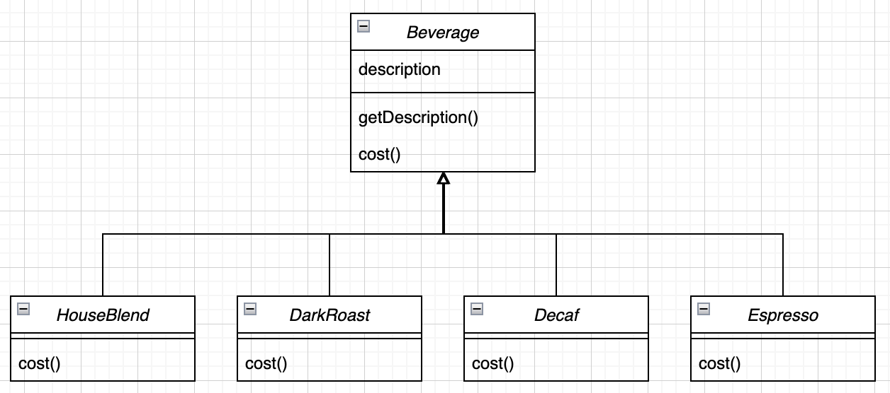
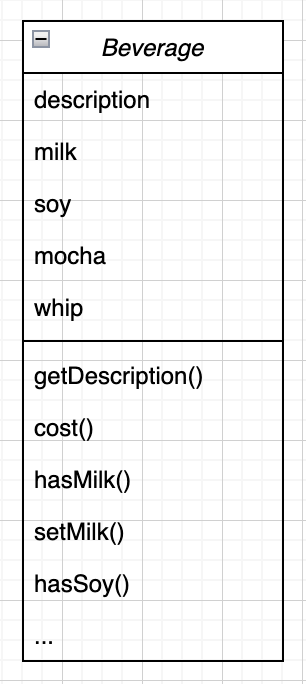
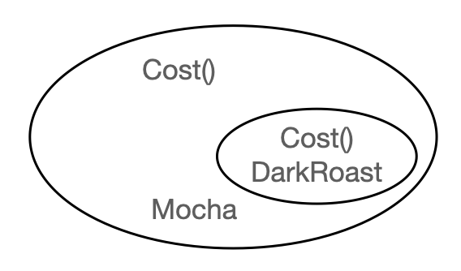
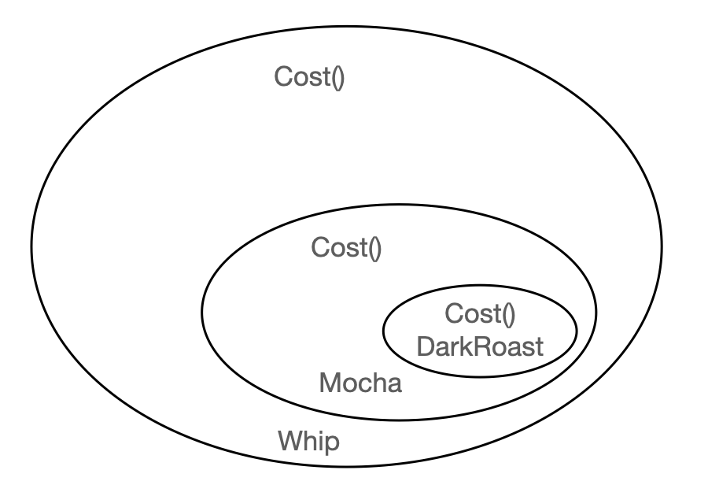
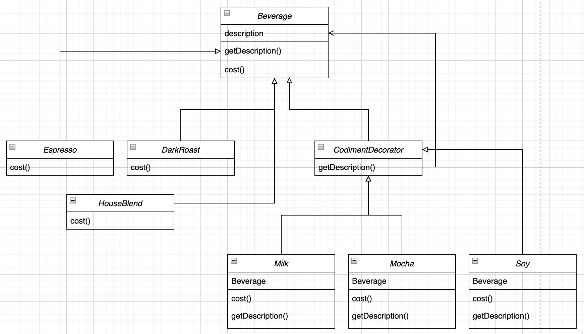
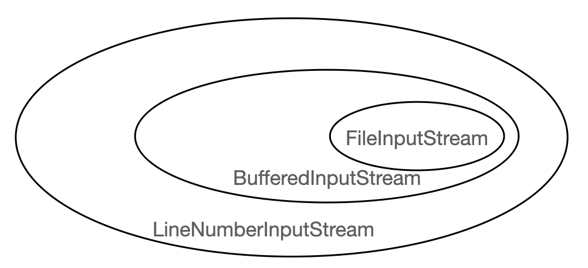
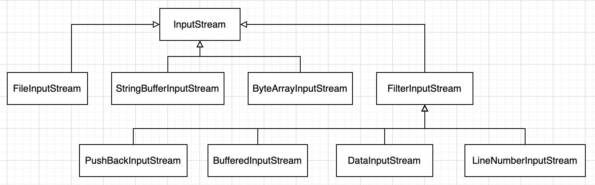

# 데코레이트 패턴

## 미리보기

개념 : 데코레이터 패턴에서는 객체에 추가적인 요건을 동적으로 첨가. 데코레이터는 서브클래스를 만드는 것을 통해서 기능을 유연하게 확장할 수 있는 방법을 제공

## 이해하기

초대형 음료를 모두 포괄하는 주문 시스템을 생각해보면 처음에 사업을 시작할때는 다음과 같은 형태로 구성.



Beverage는 음료를 나타내는 추상클래스로 모든 음료는 이 클래스의 서브 클래스가 될것이고 서브 클래스는 cost() 메소드를 구현해서 새로 정의하고 필요에 따라 description로 재정의.

음료를 주문할때 우유, 두유, 모카 등을 추가하거나 크림을 얹는 추가 주문을 할 수도 있음. 그러면 주문 시스템에서는 이러한 점을 모두 고려 필요.

즉, 하나의 서브클래스는 우유를 섞은 에스프레소, 두유를 섞은 에스프레소... 또한 가격도 일일이 정하는 엄청나게 많은 종류의 서브 클래스가 필요.

그러면 새로운 관점으로 수퍼 클래스에서 우유 포함여부, 두유 포함여부 등 추가 사항에 대한 관리를 맡기는 방법으로 생각.



각각의 추가 사항 여부를 변수를 통해 관리하고 첨가물 여부와 설정하는 메소드를 추가. 그러면 cost()는 추가 사항을 기반으로 오버라이드 해서 사용.

```java
public abstract class Beverage {

    String description;

    boolean milk;

    boolean soy;

    boolean mocha;

    boolean whip;

    public boolean hasMilk() {
        return milk;
    }

    public setMilk(boolean milk) {
        this.milk = milk;
    }

    public abstract int cost();

    // ...
}

public class Espresso extends Beverage {

    public Espresso() {
        this.milk = true;
        this.mocha = true;
    }

    public int cost() {
        int cost = Constants.ESPRESSO;
        if (this.hasMilk()) {
            cost += 1000;
        }
        if (this.hasSoy()) {
            cost += 2000;
        }
        // ...
    }
}
```

하지만 이 구조의 문제점이 아직 존재하는데 시스템은 유연해야함. 만일 임금 상승. 특정 물품 가격변동, 새로운 추가 사항, 더블 모카 등 을 생각해보면, 모든 서브클래스의 cost() 메소드를 변경하는 등 상당히 번거운 작업이 됨.

앞선 코드와 같이 상속이 무조건 유연한 디자인을 만들어주는 것은 아님. 상속은 컴파일시 완전한 행동을 결정하게 되는데 모든 서브클래스에서 똑같은 행동을 상속 받아야함. 이 부분은 구성과 위임을 통해서 해결 가능.

구성은 객체의 행동을 확장하면서 실행중에 동적으로 설정. 그러면 기존 코드는 건드리지 않으면서도 확장 가능. 즉, 변경에 대해서는 닫혀있고, 확장에 대해서는 열려있게 됨.

> 클래스는 확장에 대해서는 열려 있어야하지만 코드 변경에 대해서는 닫혀 있어야 한다.

여기서 목표는 행동을 추가하더라도 기존 코드는 건드리지 않도록 하는것인데 주의할점은 모든 부분에 대해서 이 원칙을 적용할 필요는 없음. 가장 바뀔 확률이 높은 부분을 중점적으로 적용하는 방법이 가장 현명하며, 그렇지않으면 시간낭비가 되는 작업.

주문 시스템을 다시 보면 상속을 써서 가격을 구하는 방법은 좋지못했고, 클래스가 너무나도 많음.

상속 대신 사용할 방법은 특정 음료에서 시작해서 첨가물로 음료를 장식(decorate) 하는 것. 예를 들면 모카와 휘핑 크림을 추가한 다크 로스트 커피를 주문한다면 다음과 같은 방식으로 생성.

----

* DarkRoast 객체에서 시작합니다. 해당 객체는 Beverage로 부터 상속을 받기 때문에 cost() 메소드를 가지고 있음


* Mocha 객체를 만들고 그 객체로 DarkRoast를 감싸고, Mocha 객체는 데코레이터로 이 객체의 형식은 장식하고 있는 객체를 반영합니다. 이 경우에는 Beverage 이게 됨.



* Whip 객체를 만들고 그 객체로 Mocha를 감쌉니다.



이제 가격을 계간하려면 가장 바깥쪽에 있는 데코레이터인 Whip의 cost()를 호출. 그러면 Whip에서는 그 객체가 장식하고 있는 객체한테 가격 계산을 위임하고, 가격이 구해지고 나면 거기에 휘핑 크림 가격을 더한 다음 결과를 리턴합니다. 정리하면 다음과 같음.

1. Whip의 cost() 메소드를 호출
2. Whip에서는 Mocha의 cost() 메소드를 호출
3. Mocha에서는 DarkRoast의 cost()를 호출
4. DarkRoast에서는 가격 A 를 리턴합니다.
5. Mocha에서는 리턴받은 A에 B를 더한 가격을 리턴합니다.
6. Whip에서는 리턴받은 A+B 에 C를 더한 가격을 리턴합니다.

위 내용 토대로 정리하면

* 데코레이터의 수퍼클래스는 자신이 장식하고 있는 개체의 수퍼클래스와 동일.
* 한 객체를 여러 개의 데코레이터로 감쌀 수 있음.
* 데코레이터는 자신이 감싸고 있는 객체와 같은 수퍼클래스를 가지고 있기 때문에 원래 객체(싸여져 있는 객체)가 들어갈 자리에 데코레이터 객체를 집어넣어도 상관 없음.
* 데코레이터는 자신이 장식하고 있는 객체에게 어떤 행동을 위임하는 것 외에 원하는 추가적인 작업을 수행 가능.
* 객체는 언제든지 감쌀 수 있기 때문에 실행중에 필요한 데코레이터를 마음대로 적용 가능.

데코레이터 패턴은 다음과 같이 정의.

데코레이터 패턴에서는 객체에 추가적인 요건을 동적으로 첨가한다. 데코레이터는 서브클래스를 만드는 것을 통해서 기능을 유연하게 확장할 수 있는 방법을 제공.

다음은 클래스 다이어 그램입니다.


* Decorator 객체는 Component를 구성요소로 가지고 있으며 각각의 구성요소는 직접 또는 데코레이터로 감싸져서 쓰일수가 있음.

* Decorator 객체는 자신이 장식할 ConcreteComponent 객체와 같은 인터페이스 또는 추상 클래스를 구현하고 데코레이터에서 새로운 상태 또는 메소드를 추가 가능.

* ConcreteDecorator에는 장식하고 있는 객체의 인스턴스 변수를 소유.

다이어그램을 주문 시스템에 적용하면 다음과 같은 그림이 나옴.



디자인을 가지고 코드를 만들어보면 Beverage 클래스는 다음과 같음.

```java
// Beverage 는 추상 클래스이며 두개의 메소드를 가지고 있고, cost()는 서브클래스에서 구현해야 함.
public abstract class Beverage {
    String description = "제목 없음";

    public String getDescription() {
        return description;
    }

    public abstract double cost();
}
```

다음은 첨가물을 나타내는 추상 클래스(데코레이터 클래스).

```java
// Beverage 객체가 들어갈 자리에 들어가야하므로 Beverage를 상속 받음.
public abstract class CondimentDecorator extends Beverage {

    public abstract String getDescription();
}
```

이제 베이스 클래스는 만들었으니 실제 음료를 생성.

```java
public class Espresso extends Beverage {

    public Espresso() {
        description = "에스프레소";
    }

    // 첨가물에 대한 고민없이 순수 에스프레소 가격을 반환
    public double cost() {
        return 1.99;
    }
}
```

이제 첨가물용 코드를 만들어 보면

```java
// 구성을 통해 첨가물에서 필요한 정보 외에는 구성요소에 위임.
// 구성을 위해 감싸고자 하는 객체의 인스턴스 변수와 설정하기 위한 방법으로 생성자를 사용.
public class Mocha extends CondimentDecorator {
    Beverage beverage;

    public Mocha(Beverage beverage) {
        this.beverage = beverage;
    }

    public String getDescription() {
        return beverage.getDescription() + ", 모카";
    }

    public double cost() {
        return .20 + beverage.cost();
    }
}
```

이제 데코레이터 패턴 쓰면

```java
public class CoffeeSystem {

    public static void main(String args[]) {
        Beverage beverage = new Beverage();

        beverage = new Mocha(beverage);
        beverage = new Whip(beverage);

        beverage.cost();
        beverage.getDescription();
    }
}
```

위 예시를 보면 관리해야할 객체가 늘어난다고 생각할 수도 있지만 이 부분은 추후 팩토리와 빌더 패턴을 이용해서 해결 가능. 여기서 알수있는 한가지는 현재 beverage 객체가 어떤 구성요소인지 확인하기 어렵다는 점. 이는 데코레이터 패턴이 추상 구성요소를 바탕으로 돌아가기 때문. 만일 데코레이터가 감싸고 있는 특정 구상 구성요소에 대한 작업(특정 커피 할인)이 필요하다면 데코레이터 패턴을 사용하는것을 다시 고려 필요.

## 적용된 예

데코레이터 패턴은 대표적으로 자바 I/O 에 사용. 데코레이터 패턴을 모르고 본다면 수 많은 클래스에 당황할수 있지만, 패턴을 알고본다면 쉽게 이해 가능.

파일에서 데이터를 읽어오느는 기능을 추가하는 데코레이터를 보면 다음과 같습니다.



* FileInputStream이 데코레이터로 포장될 구성요소
* BufferedInputStream도 데코레이터로 속도를 위한 버퍼 활용, 한줄씩 읽어들이기 위한 기능을 추가
* LineNumberInputStream은 데코레이터로 행번호를 붙이는 기능을 추가
* LineNumberInputStream, BufferedInputStream은 모두 FileInputStream을 확장한 클래스

java.io 클래스는 다음과 같이 구성



여기서 FilterInputStream이 추상데코레이터, FileInputStream, StringBufferInputStream, ByteArrayInputStream이 데코레이터로 포장될 구상 구성요소

자바 I/O 를 보면 수많은 클래스가 존재한다는 점도 확인 가능한데, 데코레이터 패턴을 적용한 단점이지만 어떤식으로 사용하지는 이해하기만 한다면 원하는 행동을 쉽게 구현 가능.

예시로 대문자를 소문자로 변경해주는 데코레이터를 작성한다면 다음과 같이 구현

```java
public class LowerCaseInputStream extends FilterInputStream {

    publuc LowerCaseInputStream(InputStream in) {
        super(in);
    }

    public int read() throws IOException {
        int c = super.read();
        return (c == -1 ? c : Character.toLowerCase((char)c));
    }

    //...
}
```
