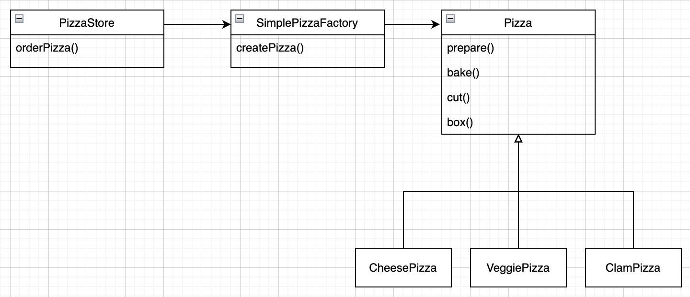
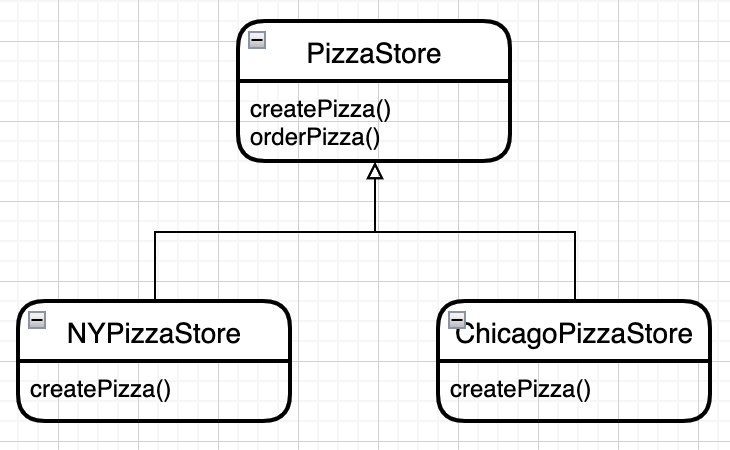

# 팩토리 패턴

## 미리보기

### 팩토리 메소드 패턴

개념 : 팩토리 메소드 패턴에서는 객체를 생성하기 위한 인터페이스를 정의하는데, 어떤 클래스의 인스턴스를 만들지는 서브클래스에서 결정

#### 팩토리 메소드 패턴 클래스 다이어그램

---


### 추상 팩토리 패턴

게념 : 추상 팩토리 패턴에서는 인터페이스를 이용하여 서로 연관된, 또는 의존하는 객체를 구상 클래스를 지정하지 않고도 생산

#### 추상 팩토리 패턴 클래스 다이어그램

---


## 이해하기 - 팩토리 메소드 패턴

new 키워드를 사용한다는 것은 구상 클래스의 인스턴스를 만드는 것으로 당연히 인터페이스가 아닌 특정 구현을 사용. 구상 클래스를 바탕으로 코딩을 하면 나중에 코드를 수정해야할 가능성이 높아지고, 유연성이 떨어짐

```java
Duck duck = new MallardDuck();
```

위 코드에서 Duck 라는 인터페이스를 써서 유연하게 만들려고 했지만 구상 클래스의 인스턴스를 만듬, 만일 특정 조건에 따라 구상 클래스를 만들어야 한다면 다음과 같은 코드가 생산

```java
Duck duck;

if (picnic) {
    duck = new MallardDuck();
} else if (hunting) {
    duck = new DecoyDuck();
} else if (inBathTub) {
    duck = new RubberDuck();
}
```

이 코드는 몇가지 구상 클래스의 인스턴스가 만들어지며, 인스턴스 형식은 실행시에 주어진 조건에 따라 결정하는데, 이는 변경하거나 확장이 있을때마다 코드를 다시 추가, 제거를 해줘야함을 의미.

여기까지 보면 new 키워드가 문제인것 같지만, 이는 자바에서 가장 근본적인 뼈대를 이루고 있는것이라 쓰지 않을 수는 없으며, 진짜 문제의 핵심은 변화임

인터페이스에 맞추어 코딩하면 시스템에서 일어날수 있는 변화를 다형성 덕분에 이겨낼수 있지만, 구상 클래스를 기반으로 코딩한다면 새로운 구상 클래스가 추가될 때마다 코드를 고쳐야하기 때문에 문제가 발생하는데 바뀔 수 있는 부분은 찾아내서 바뀌지 않는 부분하고 분리를 꼭 해야함

피자 운영 관련 시스템을 만들다고 가정

```java
public Pizza orderPizza(String type) {
    Pizza pizza;

    // 피자 종류를 바탕으로 구상 클래스의 인스턴스를 생성
    // 여기의 구상 클래스는 Pizza 인터페이스를 구현
    if ("cheese".equals(type)) {
        pizza = new CheesePizza();
    } else if ("greek".equals(type)) {
        pizza = new GreekPizza();
    } else if ("pepperoni".equals(type)) {
        pizza = new PepperoniPizza();
    }

    // pizza 객체를 만들면 공통 준비작업(토핑, 소스, 자르기 등)
    // 이는 각각의 구상 클래스에서 알수 있음
    pizza.prepare();
    pizza.bake();
    pizza.cut();
    pizza.box();
    return pizza;
}
```

이 코드에서 만일 두 가지 신제품 피자를 출시하고, 한가지 메뉴를 제외했다고 생각

```java
public Pizza orderPizza(String type) {
    Pizza pizza;

    // 피자 종류를 바탕으로 구상 클래스의 인스턴스를 생성
    // 여기의 구상 클래스는 Pizza 인터페이스를 구현
    if ("cheese".equals(type)) {
        pizza = new CheesePizza();
    //} else if ("greek".equals(type)) {
    //    pizza = new GreekPizza();
    } else if ("pepperoni".equals(type)) {
        pizza = new PepperoniPizza();
    } else if ("clam".equals(type)) {
        pizza = new ClamPizza();
    } else if ("veggie") {
        pizza = new eggiePizza();
    }

    // pizza 객체를 만들면 공통 준비작업(토핑, 소스, 자르기 등)
    // 이는 각각의 구상 클래스에서 알수 있음
    pizza.prepare();
    pizza.bake();
    pizza.cut();
    pizza.box();
    return pizza;
}
```

구상 클래스의 인스턴스를 만드는 부분이 코드 변경에 대해 닫혀있지 않으며, 피자 종류가 변경될때 마다 코드 수정이 발생. 반면 공통 준비작업 부분은 수정이 없음

orderPizza() 메소드에서 문제가 되는 부분은 구상 클래스의 인스턴스를 만드는 부분인데, 이는 캡슐화를 통해 다른 객체에게 위임을 해보면

```java
public Pizza orderPizza(String type) {
    Pizza pizza;

    // ???

    pizza.prepare();
    pizza.bake();
    pizza.cut();
    pizza.box();
    return pizza;
}

public class SimplePizzaFactory {

    public Pizza createPizza(String type) {
        Pizza pizza;

        if ("cheese".equals(type)) {
            pizza = new CheesePizza();
        } else if ("pepperoni".equals(type)) {
            pizza = new PepperoniPizza();
        } else if ("clam".equals(type)) {
            pizza = new ClamPizza();
        } else if ("veggie") {
            pizza = new eggiePizza();
        }

        return pizza;
    }
}
```

객체 생성을 처리하는 클래스를 팩토리라고 하면, 이제 orderPizza() 메소드는 새로 만든 객체의 클라이언트, 즉 새로 만든 객체를 호출하게 됨. 이는 피자가 필요할때마다 피자 공장에 요청하는 거라고 이해. orderPizza()는 더 이상 어떤 피자를 만들어야할지 고민없이 인터페이스에 정의된 메서드만 호출하면 됨

추가로 createPizza() 메소드를 재사용 가능. 수정사항이 생겨도 이 메소드만 수정하면 됨

간혹가다 정적 팩토리라고 해서 static 키워드로 선언할수도 있는데, 이는 객체를 생성하기 위한 메소드를 실행하기 위해 객체의 인스턴스를 만들지 않아도 되는 장점이 있지만 서브 클래스를 만들어서 객체 생성 메소드의 행동을 변경할 수 없다는 단점도 존재

이제 클라이언트 코드를 수정하면

```java
public class PizzaStore {
    SimplePizzaFactory factory;

    public PizzaStore(SimplePizzaFactory factory) {
        this.factory = factory;
    }

    public Pizza orderPizza(String type) {
        Pizza pizza;

        // new 연산자 대신 팩토리 객체에 있는 create 메소드 사용
        // 더 이상 구상 클래스의 인스턴스를 만들 필요가 없음
        pizza = factory.createPizza(type);

        pizza.prepare();
        pizza.bake();
        pizza.cut();
        pizza.box();

        return pizza;
    }
}
```

이는 간단한 팩토리로 디자인 패턴이라고 할 수는 없음. 하지만 짚고 넘어갈 필요가 있는데, 다음은 새로 만든 피자 가게 프로그램의 클래스 다이어그램



이제 PizzaStore가 프렌차이즈를 운영하게 되었다고 생각. 각각의 지점에서는 지역별로 조금씩 차이점이 존재하는데, 한 지점은 빵이 얇고 치즈가 적게 들어가는 피자, 다른 지점은 두꺼운 빵에 많은 치즈를 넣는 스타일의 피자라고 가정

먼저 SimplePizzaFactory를 빼고 서로 다른 팩토리를 만든 다음 PizzaStore에서 적당한 팩토리를 사용

```java
NYPizzaFactory nyFactory = new NYPizzaFactory();
PizzaStore nyStore = new PizzaStore(nyFactory);
nyStore.order("Veggie");

ChicagoPizzaFactory chicagoFactory = new ChicagoPizzaFactory();
PizzaStore chicagoStore = new PizzaStore(chicagoFactory);
chicagoStore.order("Veggie");
```

분점에서 팩토리를 써서 피자를 만들기는 하지만 굽는 방식이 달라진다거나 피자를 자르는 방식이 달라진다는 요구사항이 생기면, 결국 피자 가게와 피자 제작 과정 전체를 하나로 묶어주는 프레임워크를 만들어주어야한다는 결론에 도달

그럼 어떻게 피자를 만드는 행위 자체는 전부 PizzaStore 클래스에 국한시키면서 분점마다 고유의 스타일을 살릴 수 있도록 할까?

팩토리를 통해 피자를 만드는 부분을 이제 추상 메서드로 선언하고 각 지역마다 스타일에 맞게 PizzaStore의 서브클래스로 생성

```java
public abstract class PizzaStore {

    public Pizza orderPizza(String type) {
        Pizza pizza;

        pizza = createPizza(type);

        pizza.prepare();
        pizza.bake();
        pizza.cut();
        pizza.box();

        return pizza;
    }

    protected abstract Pizza createPizza(String type);
}
```

PizzaStore에서 주문시스템은 이미 잘 갖추어짐. 단지 변화하는 부분은 피자의 스타일. 이렇게 달라지는 부분은 createPizza() 메소드에 넣고 이 메소드에서 해당 스타일의 피자를 만드는 작업을 모두 책임지도록 PizzaStore의 서브클래스에서 createPizza() 메소드를 구현



서브클래스는 orderPizza()는 정의한 그대로 사용하기만 하고, createPizza()를 스타일에 맞게 구현

```java
public class NYPizzaStore extends PizzaStore {
    Pizza createPizza(String item) {
        if (item.equals("cheese")) {
            return new NYStypeCheesePizza();
        } else if () {
            // ...
        }
    }
}
```

PizzaStore를 수정한 결과 구상 클래스의 인스턴스를 만드는 일을 한 객체가 전부 처리하는 방식에서 서브클래스에서 처리하는 방식으로 변경, 즉 Pizza 인스턴스를 만드는 일은 이제 팩토리 역활을 하는 메소드에서 처리

> 모든 팩토리 패턴에서는 객체 생성을 캡슐화 합니다. 팩토리 메소드 패턴에서는 서브클래스에서 어떤 클래스를 만들지 결정하게  함으로써 객체 생성을 캡슐화 합니다.

앞선 PizzaStore는 생산자 클래스, Pizza는 제품 클래스로. 생산자 클래스에서는 추상 제품 클래스에 의존하는 코드가 들어갈수 있지만 구상 제품 클래스는 미리 알수는 없음


다른 모든 팩토리를 쓸 때와 마찬가지로 팩토리 메소드 패턴을 사용하여 구상 형식의 인스턴스를 만드는 작업을 캡슐화 가능. Creator 추상 클래스에서 객체를 만들기 위한 팩토리 메소드를 위한 인터페이스를 제공하고, Creator의 다른 메소드는 팩토리 메소드에 의해 생산된 제품을 가지고 필요한 작업을 처리

이 패턴의 초점은 서브클래스에서 실행중에 어떤 클래스의 인스턴스를 만들지를 결정하기보다는, 생산자 클래스 자체가 실제 생산된 제품에 대한 사전 지식이 전혀 없이 만들어지는 부분

만일 팩토리를 사용하지않고 PizzaStore클래스를 만든다고 생각하면 다음과 같은 코드가 생성

```java
public class DependentPizzaStore {

    public Pizza createPizza(String style, String type) {
        Pizza pizza = null;
        if (style.equals("NY")) {
            if (type.equals("cheese")) {
                // ...
            } else if () {
                // ...
            }
        } else if () {
            if () {
                // ...
            }
        }
        // ...
    }
}
```

객체 인스턴스를 직접 만들면 구상 클래스에 의존. 이 PizzaStore에서는 모든 피자 객체들을 직접적으로 의존. 만들 피자 구상 클래스가 변경이 되면 PizzaStore의 코드도 수정이 필요하며, 피자 구상 클래스가 추가될때마다 PizzaStore는 더 많은 객체를 의존

구상 클래스에 대한 의존성을 줄이는 방법이 의존성 뒤집기 원칙(Dependency Inversion Principle)

> 추상화된 것에 의존하도록 만들어라. 구상 클래스에 의존하도록 만들지 않도록 한다.

이 원칙에는 고수준 구성요소가 저수준 구성요소에 의존하면 안된다는것도 내포. 항상 추상화에 의존하도록 만들어야 함

앞선 코드르면 보면 PizzaStore는 고수준 구성요소라고 할 수 있고, 피자 클래스들은 저수준 구성요소라고 할 수 있음. PizzaStore 클래스는 구상 피자 클래스들에 의존하고 있음

의존성 뒤집기 원칙에 의하면 구상 클래스처럼 구체적인 것이 아닌 추상 클래스나 인터페이스와 같이 추상적인 것에 의존하는 코드를 만들어야 함

이 의존성을 팩토리 메소드 패턴을 적용하고 나면 고수준 구성요소인 PizzaStore와 저수준 구성요소인 피자 객체들이 모두 추상 클래스인 Pizza에 의존, 물론 팩토리 메소드 패턴이 의존성 뒤집기 원칙을 준수하기 위한 유일한 기법은 아니지만 적합한 방법중 하나임

다음은 의존성 뒤집기 원칙에 위배되는 객체지향 디자인을 피하는데 도움이 되는 가이드라인

1. 어떤 변수에도 구상 클래스에 대한 래퍼런스를 저장 안함
2. 구상 클래스에서 유도된 클래스를 생성 안함
3. 베이스 클래스에 이미 구현되어 있던 메소드를 오버라이드 안함

이 규칙은 꼭 지켜야하는 규칙이 아닌 지향해야 할 규칙으로 가이드라인을 완벼하게 따르는 것이 없기도 함. 다만 원칙을 지키지 못하게 되더라도 그 이유를 알고 있는 상태에서 그렇게 하면 됨. 예를 들어 어떤 클래스가 거의 바뀌지 않을 것 같은 경우에는 그 클래스의 인스턴스를 만드는 코드를 작성한다고 해도 큰 문제가 생기지 않음. 대표적으로 String 객체로 원칙에 위배되지만 문제가 안되는 경우

다만 만들고 있는 클래스가 바뀔 가능성이 있다면 팩토리 메소드 패턴 같은 기법을 써서 변경될 수 있는 부분을 캡슐화해야 함

## 이해하기 - 추상 팩토리 패턴

뉴욕과 시카고에서 사용하는 재료 종류는 서로 다른데 서로 다른 종류의 재료들을 제공하기 위해 원재료군을 처리할 방법을 생각해야함


원재료를 생산하기 위한 공장을 만들어 보면, 이 공장에서는 원재료군에 들어있는 각각의 원재료를 생산, 먼저 인터페이스부터 정의

```java
public interface PizzaIngredientFactory {

    public Dough createDough();
    public Sauce createSauce();
    public Cheese createCheese();
    public Veggies[] createVeggies();
    public Pepperoni createPepperoni();
    public Clams createClam();
}
```

1. 지역별로 각 생성 메소드를 구현하는 PizzaIngredientFactory 팩토리를 구현
2. RedPeppers, ThickCrustDough와 같이 팩토리에서 사용할 원재료 클래스들을 구현
3. 그리고 나서 새로 만든 원재료 공장을 PizzaStore 코드에서 사용하도록 함으로써 모든 것을 하나로 묶어줌

뉴욕 원재료 공장은 다음과 같이 구현

```java
public class NYPizzaIngredientFactory implements PizzaIngredientFactory {

    public Dough createDough() {
        return new ThinCrustDough();
    }

    public Sauce createSauce() {
        return new MarinaraSauce();
    }

    public Cheese createCheese() {
        return new ReggianoCheese();
    }

    public Veggies[] createVeggies() {
        Veggies veggies[] = {new Garlic(), new Onion(), new Mushroom()};
        return veggies;
    }

    public Pepperoni createPepperoni() {
        return new SlicedPepperoni();
    }

    public Clams createClam() {
        return new FreshClams();
    }
}
```

팩토리 준비가 끝나고 이제 재료를 생산할 준비가 끝났고, Pizza 클래스에서 팩토리로 생산한 원재료만 사용하도록 코드를 수정해야함

```java
public abstract class Pizza {
    String name;
    Dough dough;
    Sauce sauce;
    Veggies veggies[];
    Cheese cheese;
    Pepperoni pepperoni;
    Clams clam;

    abstract void prepare();

    void bake() {
        // ...
    }

    void cut() {
        // ...
    }

    void box() {
        // ...
    }
}
```

Pizza 추상 클래스 준비가 끝났으니 뉴욕풍 피자를 생각, 기존과 달라진 점은 원재료를 공장에서 바로 가져온다는 것

NYCheesePizza와 ChicagoCheeaePizza 클래스는 지역별로 다른 재료를 사용하는 점 말고는 다른점이 없으므로 피자마다 클래스를 지역별로 만들필요가 없음

```java
public class CheesePizza extends Pizza {

    PizzaIngredientFactory ingredientFactory;

    public CheesePizza(PizzaIngredientFactory ingredientFactory) {
        this.ingredientFactory = ingredientFactory;
    }

    void prepare() {
        Dough dough = ingredientFactory.createDough();
        Sauce sauce = ingredientFactory.createSauce();
        Cheese cheese = ingredientFactory.createCheese();
    }
}
```

피자 코드에서 팩토리를 사용해서 피자를 생성, 만들어지는 재료는 어떤 팩토리를 쓰는지에 따라 달라짐. 피자 클래스는 전혀 신경쓰지 않아도 됨

```java
public class NYPizzaStore extends PizzaStore {

    protected Pizza createPizza(String item) {
        Pizza pizza;
        PizzaIngredientFactory factory = new NYPizzaIngredientFactory();
        if (item.equals("cheese")) {
            pizza = new CheesePizza(factory);
        } else if (item.equals("clam")) {
            pizza = new ClamPizza(factory);
        }
        // ...

        return pizza;
    }
}
```

지금까지 한것을 정리해보면

1. 추상 팩토리를 도입해서 서로 다른 피자에서 필요로 하는 원재료군을 생산하기 위한 방법을 구축
2. 추상 팩토리를 통해서 제품군을 생성하기 위한 인터페이스 제공, 이 인터페이스를 이용하는 코드를 만들면 제품을 생산하는 실제 팩토리와 분리시킬 수 있음
3. 코드가 실제 제품과 분리되어 있으므로 다른 공장을 사용하면 다른 결과를 얻을수 있음

지금까지 작성한 코드를 PizzaStore 까지 포함시켜 전체적인 다이어그램은 다음과 같습니다.


