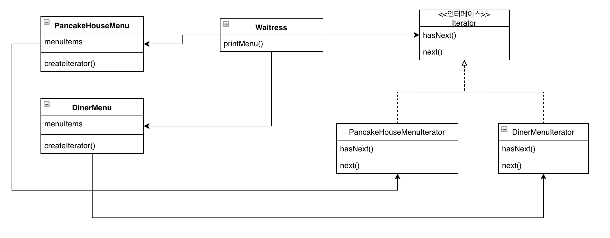
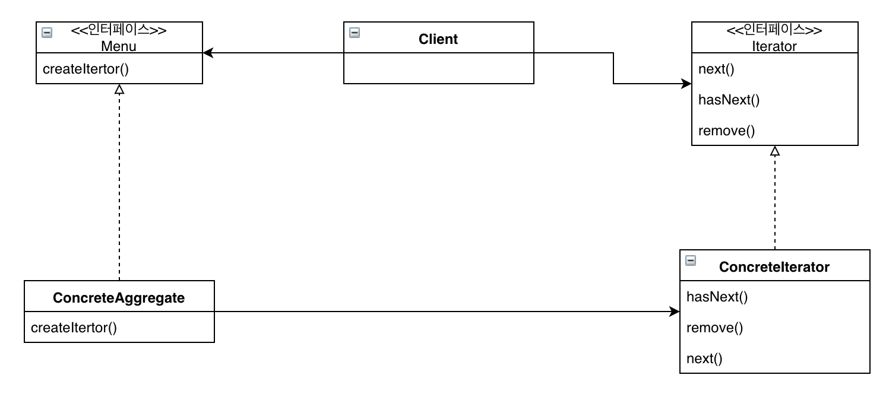

# 이터레이터와 컴포지트 패턴

## 미리보기

이터레이터 개념: 컬렉션을 표현하는 방법을 노출시키지 않으면서도 집합체 내에 있는 모든 객체들에 하나씩 접근하는 방법을 제공

컴포지트 개념: 객체들을 트리 구조로 구성하여 부분-전체 계층구조를 구현. 컴포지트 패턴을 이용하면 클라이언트에서 개별 객체와 복합 객체를 똑같은 방법으로 다루도록 가능

* 반복자를 이용하면 내부 구조를 드러내지 않으면서도 클라이언트로부터 컬렉션 안에 들어있는 모든 원소들에 접근 가능
* 이터레이터 패턴을 이용하면 집합체에 대한 반복작업을 별도의 객체로 캡슐화 가능
* 이터레이터 패턴을 이용하면 컬렉션에 있는 모든 데이터에 대해서 반복작업을 하는 역할을 컬렉션에서 분리 가능
* 이터레이터 패턴을 쓰면 다양한 집합체에 들어있는 객체에 대한 반복작업들에 대해 똑같은 인터페이스를 적용할 수 있기 때문에, 집합체에 있는 객체를 활용하는 코드를 만들 때 다형성 활용 가능
* 한 클래스에는 될 수 있으면 한 가지 역할만 부여하는 것이 좋음
* 컴포지트 패턴에서는 개별 객체와 복합 객체를 모두 담아둘수 있는 구조를 제공
* 컴포지트 패턴을 이용하면 클라이언트에서 개별 객체와 복합 객체를 똑같은 방법으로 다룰수 있음
* 복합 구조에 들어있는 것을 구성요소라고 하는데, 구성요소에는 복합 객체와 잎 노드가 존재
* 컴포지트 패턴을 적용할 때는 여러 가지 장단점을 고려 필요, 상황에 따라 투명성과 안정성 사이에서 적절한 평형점을 찾아야 함

## 이해하기

식당과 팬케이크 식당이 합병한다고 생각해보자. 서로의 식당은 각각 MenuItem을 구현하기로 합의했고, 아침에는 팬케이크를 점심에는 식당 메뉴를 팔기로 함

```java
@Getter
@AllArgsConstructor
public class MenuItem {
    String name;
    String description;
    String vegetarian;
    double price;
}
```

그런데 막상 서로 구현한 코드를 보면 차이가 존재함

```java
@Getter
public class PancakeHouseMenu {
    ArrayList menuItems;

    public PancakeHouseMenu() {
        menuItems = new ArrayList();

        addItem(/* ~ */);
        addItem(/* ~ */);
        addItem(/* ~ */);
        addItem(/* ~ */);
    }

    public void addItem(/* param */) {
        MenuItem menuItem = new MenuItem(/* param */);
        menuItems.add(menuItem);
    }
}

@Getter
public class DinerMenu {
    static final int MAX_ITEMS = 6;
    int numberOfItems = 0;
    MenuItem[] menuItems;

    public DinerMenu {
        menuItems = new MenuItem[MAX_ITEMS];

        addItem(/* ~ */);
        addItem(/* ~ */);
        addItem(/* ~ */);
        addItem(/* ~ */);
    }

    public void addItem(/* param */) {
        MenuItem menuItem = new MenuItem(/* param */);
        if (numberOfItems >= MAX_ITEMS) {
            System.err.println("");
        } else {
            menuItems[numberOfItems] = menuItem;
            numberOfItems = numberOfItems + 1;
        }
    }
}
```

팬케이크 식당은 메뉴를 리스트로 관리하고 식당은 배열로 관리. 이렇게 되면 어떤 문제가 발생하는지 클라이언트 입장에서 한번 보면

클라이언트는 다음과 같은 기능이 필요

1. 메뉴의 모든 항목을 출력
2. 아침 식사 항목만 출력
3. 점심 식사 항목만 출력
4. 채식주의자용 메뉴 항목만 출력
5. 해당 항목이 채식주의자용인지 확인

먼저 메뉴의 모든 항목을 출력하는 로직을 생각

각 메뉴에서 모든 항목을 출력하려면 각각의 메뉴에서 getMenuItem() 메소드를 호출해서 메뉴 항목을 가져와야함

```java
PancakeHouseMenu pancakeHouseMenu = new PancakeHouseMenu();
ArrayList breakfastItem = PancakeHouseMenu.getMenuItems();

DinerMenu dinerMenu = new DinerMenu();
MenuItem[] lunchItems = dinerMenu.getMenuItems();
```

그리고 각 항목을 출력하기 위해 순환문을 돌리면

```java
for (int i=0; i < breakfastItem.size(); i++) {
    MenuItem menuItem = (MenuItem)breakfastItem.get(i);
    // print
}
for (int i=0; i < lunchItems.length; i++) {
    MenuItem menuItem = lunchItems[i];
    // print
}
```

이러면 각 아이템에 대해서 반복작업을 하기 위해 두 개의 순환문을 사용. 추가로 레스토랑이 합병이 된다면 순환문 한개가 추가로 필요

여기서 중요한 점은 "바뀌는 부분을 캡슐화하라". 메뉴에서 리턴되는 객체 컬렉션의 형식이 다르기 때문에 반복 작업이 달리지는 점

1. breakfastItems의 각 항목에 대해서 순환문을 돌릴 때는 ArrayList의 size()와 get() 메소드를 사용
2. lunchItems에 대해서 순환문을 돌릴 때는 배열의 length와 배열 첨자를 사용

그러면 만일 반복 작업을 처리하는 방법을 캡슐화한 Iterator라는 객체가 있다면?

```java
Iterator iterator = breakfastMenu.createIterator();
while(iterator.hasNext()) {
    MenuItem menuItem = (MenuItem)iterator.next();
}
Iterator iterator2 = lunchMenu.createIterator();
while(iterator2.hasNext()) {
    MenuItem menuItem = (MenuItem)iterator2.next();
}
```

이게 이터레이터 패턴. 이는 Iterator라는 인터페이스에 의존


이 인터페이스만 있다면 배열, 리스트, 해시테이블은 물론 어떤 종류의 객체 컬렉션에 대해서도 반복자를 구현 가능

이 개념을 적용해보면


```java
public interface Iterator {
    boolean hasNext();
    Object next();
}

public class DinerMenuIterator implements Iterator {
    MenuItem[] items;
    int position = 0;

    public DinerMenuIterator(MenuItem[] items) {
        this.items = items;
    }

    public Object next() {
        MenuItem menuItem = items[position];
        position = position + 1;
        return menuItem;
    }

    public boolean hasNext() {
        if (position > items.length || items[position] == null) {
            return false;
        }
        return true;
    }
}

public class DinerMenu {
    
    MenuItem[] menuItems;
    // ...

    public Iterator createIterator() {
        return new DinerMenuIterator(menuItems);
    }
}
```

이제 클라이언트는 menuItem이 어떻게 관리되는지 알 필요가 없이, Iterator 인터페이스에 맞게만 구현하면 됨

팬케이크 메뉴도 해당 이터레이터를 상속받은 클래스를 만든다음 반환해주면 됨 (리스트 자체로도 지원하는것 참고)

지금까지 한 디자인을 한번 확인해보면



반복자를 이용해서 컬렉션 입장에서는 그 안에 들어있는 모든 항목에 접근할 수 있게 하기 위해서 여러 메소드를 외부에 노출시키지 않으면서도, 컬렉션에 모든 객체에 접근할 수 있게 됨, 즉 캡술화가 됨

Waitress 클래스는 Menu가 배열인지 리스트인지 구별할 필요가 없이. Iterator 인터페이스를 통해 컬렉션에 들어있는 모든 객체를 사용할 수 있게 됨

이번에는 Menu 인터페이스를 구현해보면, 현재 디자인은 Waitress 객체가 구상 객체에 의존한 형태. 이를 Menu 인터페이스에 의존하도록 바꾸면 "특정 구현이 아닌 인터페이스에 맞춰서 프로그래밍한다" 는 원칙을 따르기 때문에 의존성을 줄일수 있음


이 패턴을 이용하면 집합체 내에서 어떤 식으로 일이 처리되는지 모르는 상태에서 그 안에 들어있는 모든 항목들에 대해서 반복작업을 수행 가능. 또한 컬랙션 객체 안에 들어있는 모든 항목에 접근하는 방식이 통일되어 있으면 어떤 종류의 집합체에 대해서도 사용할 수 있는 다형적인 코드를 만들수 있음

또 다른 중요한 점은 이터레이터 패턴을 사용하면 모든 항목에 일일이 접근하는 작업을 컬렉션 객체가 아닌 반복자 객체에서 맡게된다는 점. 이렇게하면 집합체의 인터페이스 및 구현이 간단해지고, 집합체에서는 반복작업에서 손을 떼고 원래 자신이 할 일(객체 컬렉션 관리)에만 전념 가능

다음은 이터레이터 패턴의 클래스 다이어그램



집합체에서 내부 컬렉션과 관련된 기능과 반복자용 메소드 관련 기능을 전부 구현하도록 했다면 이게 왜 나쁜지를 먼저 이해 하자면

클래스에서 원래 그 클래스의 역할(집합체 관리) 외에 다른 역할(반복자 메소드)을 처리하도록 하면 두 가지 이유로 클래스가 변경될 수가 있음. 첫째, 컬레션이 변경되는 경우. 둘째, 반복자 관련 기능이 변경되는 경우 클래스를 변경해야 함

> 클래스를 바꾸려는 이유는 한 가지 뿐이어야 한다.

클래스를 고치는 것은 최대한 피해야함. 코드를 변경할 만한 이유가 두 가지가 되면 그만큼 고쳐야할 가능성이 커지게 됨. 이 원칙을 따라 한 역할은 한 클래스에서만 맡겨야 함

이는 응집도라는 광범위한 용어가 있는데, 어떤 모듈 또는 클래스의 응집도가 높다는 것은 연관된 기능이 묶여있다는 뜻

이번에는 만든 코드에서 카페 메뉴가 추가되었다고 생각. 단, 이번에는 해시로 메뉴 아이템이 구성되어있는 경우

```java
public class CafeMenu {
    Hashtable menuItems = new Hashtable();
}
```

Iterator 인터페이스에 맞게 구현을 해주려면 해당 인터페이스를 반환해주는 메소드가 필요

```java
public class CafeMenu implements Menu {
    Hashtable menuItems = new Hashtable();

    public Iterator createIterator() {
        return menuItems.values().iterator();
    }
}
```

아직까지는 간단하게 처리할수 있는 수준, 하지만 지금까지 규칙과는 다르게 메뉴 안에 메뉴를 넣는 경우라면? DinerMenu 컬렉션 원소에 디저트 메뉴를 추가하고 싶은 경우

이 새로운 디자인은 어떤 것이 필요하지 정리

1. 메뉴, 서브 메뉴, 항목 등을 모두 집어넣을 수 있는 트리 형태의 구조
2. 각 메뉴에 있는 모든 항목에 대해 돌아가면서 작업을 할 수 있는 방법
3. 아이템에 대해서 유연한 반복 작업 (메인 메뉴만 또는 서브 메뉴만 반복)

이 문제를 해결하기 위해 새로운 패턴이 필요. 이는 컴포지트 패텬으로 해결 가능

컴포지트 패턴을 이용하면 객체의 구성과 개별 객체를 노드로 가지는 트리 형태로 객체를 구축하고, 이런 복합 구조를 사용하면 복합 객체와 개별 객체애 대해 똑같은 작업을 적용 가능


이 패턴을 메뉴에 적용하면 Client는 Waitress가 되고, Component는 MenuComponent라는 새로운 인터페이스를, Leaf는 MenuItem이라는 컬렉션으로 관리되던 부분을 마지막으로 Menu는 Composite와 매칭

먼저 MenuComponent 추상 클래스부터 시직해보면. 이는 잎 노드와 복합 노드 모두에서 쓰이는 인터페이스 역할을 한다는 점이 중요

```java
public abstract class MenuComponent {

    public void add(MenuCompoment menuComponent) {
        throw new UnsupportedOperationException();
    }
    public void remove(MenuCompoment menuComponent) {
        throw new UnsupportedOperationException();
    }
    public MenuCompoment getChild(int i) {
        throw new UnsupportedOperationException();
    }
    public String getName() {
        throw new UnsupportedOperationException();
    }
    public String getDescription() {
        throw new UnsupportedOperationException();
    }
    public String getPrice() {
        throw new UnsupportedOperationException();
    }
    public String isVegetarian() {
        throw new UnsupportedOperationException();
    }
    public String print() {
        throw new UnsupportedOperationException();
    }
}
```

MenuItem 클래스의 경우 컴포지트 패턴의 Leaf에 해당하는 부분으로 앞서 구현한 MenuComponent를 구현만 해주면 됨

자세히 봐야하는 클래스는 복합 객체 클래스인 Menu. 여기는 MenuItem은 물론 Menu도 저장할수 있어야함

```java
public class Menu extends MenuComponent {
    ArrayList menuComponents = new ArrayList();
    // ...

    public void add(MenuComponent menuComponent) {
        menuComponents.add(menuComponent);
    }

    public void print() {
        Iterator iterator = menuComponents.iterator();
        while (iterator.hasNext()) {
            MenuComponent menuComponent = (MenuComponent) iterator.next();
            menuComponent.print();
        }
    }
}
```

클라이언트인 Waitress는 이제 최상위 메뉴 하나만 관리하게 되고, 메소드 하나만 호출하면 알아서 처리

대신 컴포지트 패턴은 Component 클래스가 두 종류의 기능이 모두 들어있다 보니 안정성은 앞서 알려준 단일 역할 원칙을 위배했지만 투명성을 확보한 패턴. 투명성을 확보함으로써 클라이언트는 복합 겍체와 잎 노드를 똑같은 방식으로 처리, 즉 구분없이 투명하게 처리

다음은 이터레이터까지 적용한 코드

```java
public class Menu extends MenuComponent {
    ArrayList menuComponents = new ArrayList();
    // ..

    public Iterator createIterator() {
        return new CompositeIterator(menuComponents.iterator());
    }
}

public class MenuItem extends MenuComponent {
    // ...

    public Iterator createIterator() {
        return new NullIterator(); // 아무 일도 하지 않는 반복자
    }
}

public class CompositeIterator implements Iterator {
    Stack stack = new Stack();

    public CompositeIterator(Iterator iterator) {
        stack.push(iterator);
    }

    public Object next() {
        if (hasNext()) {
            Iterator iterator = (Iterator) stack.peek();
            MenuComponent component = (MenuComponent) iterator.next();
            if (component instanceof Menu) {
                stack.push(component.createIterator());
            }
            return component;
        } else {
            return null;
        }
    }

    public boolean hasNext() {
        if (stack.empty()) {
            return false;
        } else {
            Iterator iterator = (Iterator) stack.peek();
            if (!iterator.hasNext()) {
                stack.pop();
                return hasNext();
            } else {
                return true;
            }
        }
    }
}
```

채식주의자용 메뉴를 한다거나 그런 커스텀의 경우 조건문만 추가해서 클라이언트에서 처리, 또한 널 객체는 try/catch로 받아서 처리
