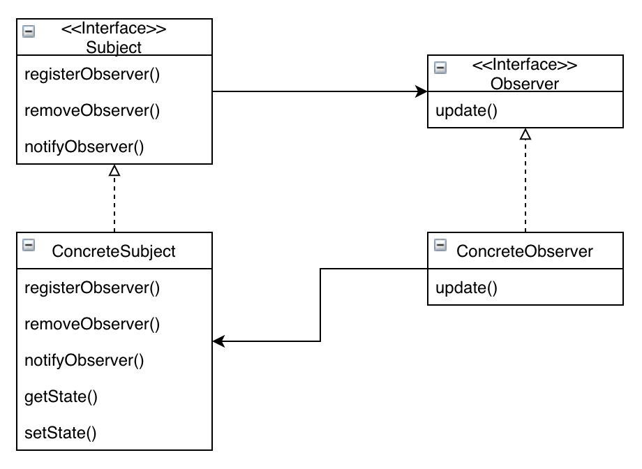
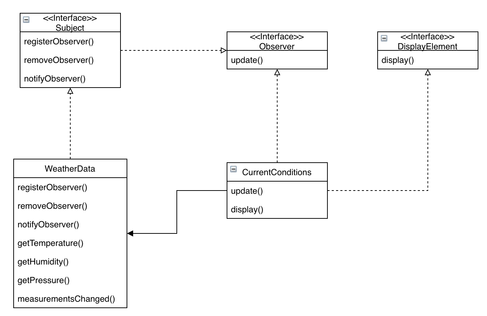
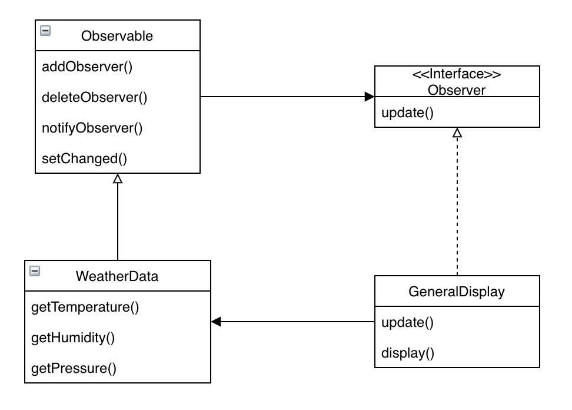

# 옵저버 패턴

## 미리보기

개념: 한 객체의 상태가 바뀌면 그 객체에 의존하는 다른 객체들한테 연락이 가고 자동으로 내용이 갱신되는 방식으로 일대다 의존성을 정의

* 옵저버 패턴에서는 객체들 사이에 일대다 관계를 정의
* 주제, 또는 Observable 객체는 동일한 인터페이스를 써서 옵저버에 연락
* Observable에서는 옵저버들이 Observer 인터페이스를 구현한다는 것을 제외하면 옵저버에 대해 전혀 모르기 때문에. 이들 사이의 결합은 느슨한 결합
* 옵저버 패턴을 이용하면 주제 객체에서 데이터를 보내거나 (푸시 방식) 옵저버가 데이터를 가져오는 (풀 방식)을 사용 (풀 방식이 더 옮은 것으로 간주)
* 옵저버들한테 연락을 돌리는 순서에 절대로 의존하면 안됨
* 자바에는 범용으로 쓸 수 있는 java.util.Observable을 비롯하여 옵저버 패턴을 구현한 것들이 여럿 존재
* java.util.Observable의 몇가지 문제점에 주의
* 필요하면 언제든지 주저하지 말고 Observable 클래스에 상응하는 클래스를 직접 구현
* 스윙 및 여러 GUI 프레임워크에서 옵저버 패턴 사용
* 옵저버 패턴은 JavaBeans나 RMI를 비롯하여, GUI가 아닌 다른 부분에서도 광범위하게 사용

> 서로 상호작용을 하는 객체 사이에서는 가능하면 느슨하게 결합하는 디자인을 사용해야 한다.

## 이해하기

옵저버 패턴을 이해하기 위한 예시로 기상 모니터링 애플리케이션을 보면, 실제 기상 정보를 수집하는 기상 스테이션, 기상 스테이션에서 오는 데이터를 추적하는 WeatherData 객체, 현재 기상조건을 보여주는 디스플레이로 구성

다음은 WeatherData 클래스

```java
public class WeatherData {
    
    public float getTemperature();
    public float getHumidity();
    public float getPressure();

    // 기상 관측값이 갱신될때마다 알려주기 위한 메소드
    // 현재 조건, 기상 통계, 기상 예측 값을 디스플레이를 갱신하도록 구현
    public void measurementsChanged();
}
```

measurementsChanged 메소드는 현재의 기상 관측값을 디스플레이에 갱신하도록 구현하는 메소드인데 간단하게 생각하면 다음과 같이 구현

```java
public void measurementsChanged() {

    float temp = getTemperature();
    float humidity = getHumidity();
    float pressure = getPressure();

    // 각각의 디스플레이 항목을 불러서 갱신
    currentConditionsDisplay.update(temp, humidity, pressure);
    statisticsDisplay.update(temp, humidity, pressure);
    forecastDisplay.update(temp, humidity, pressure);
}
```

현재 구현은 구현체 기반으로 만들었고, 바뀔수 있는 부분을 캡슐화하지 못한 부분이 존재. 이제 옵저버 패턴을 알아보고 해당 코드를 수정

옵저버 패턴은 흔히 출판+구독 이라고 생각

다음은 신문 구독 절차

1. 신문사가 신문지을 찍어냄
2. 독자가 구독신청을 하면 신문사가 신문지가 나올때마다 배달
3. 신문을 더 이상 보고 싶지 않으면 구독 해지 신청
4. 신문사는 여러 개인 독자, 호텔, 항공사 및 기타 회사 등에서 꾸준히 구독 및 해지

여기서 옵저버 패턴은 출판사를 주제(subject), 구독자를 옵저버(observer)라고 표현해. 주제의 데이터가 달라지면 옵저버한테 그 소식이 전달

옵저버 패턴은 다음과 같은 식으로 정의

개념: 옵저버 패턴에서는 한 객체의 상태가 바뀌면 그 객체에 의존하는 다른 객체들한테 연락이 가고 자동으로 내용이 갱신되는 방식으로 일대다 의존성을 정의

옵저버 패턴을 구현하는 방법은 여러 가지가 있지만, 대부분 주제 인터페이스와 옵저버 인터페이스가 들어있는 클래스 디자인을 바탕.

다음은 클래스 다이어그램



주제를 나타내는 Subject 인터페이스는 객체에서 옵저버를 등록하거나 옵저버 목록에서 탈퇴하는 메소드를 사용. 그리고 각 주제마다 옵저버를 가지고 있을수 있고, 옵저버가 될 객체는 옵저버 인터페이스를 구현. 해당 인터페이스에는 주제의 상태가 바뀌었을때 호출되는 메소드만 존재.

이러한 옵저버 패턴은 느슨한 결합. 느슨한 결합은 서로 상호작용을 하긴하지만 서로에 대해 잘 모름

주제는 옵저버에 대해 아는것은 특정 인터페이스를 구현한다는 정보뿐으로, 옵저버를 언제든지 추가하거나 제거할수 있지만, 주제를 변경할 일은 없음. 또한 주제와 옵저버는 서로 독립적이여서 주제가 변경되도 옵저버가 변경할 필요는 없으므로 느슨한 결합

> 서로 상호작용을 하는 객체 사이에서는 가능하면 느슨하게 결합하는 디자인을 사용해야 한다.

이제 옵저버 패턴을 기반으로 기상 스테이션을 구현



먼저 인터페이스 부터 시작

```java
public interface Subject {
    public void registerObserver(Observer o);
    public void removeObserver(Observer o);
    public void notifyObserver();
}

public interface Observer {
    public void update(float temp, float humidity, float pressure);
}

public interface DisplayElement {
    public void display();
}
```

여기서 Observer 클래스의 update 메소드는 옵저버에게 전달되는 상태값들인데, 이 부분은 뒤에서 설명

이제 WeatherData에서 Subject 인터페이스를 구현

```java
@Getter
public class WeatherData implements Subject {
    private ArrayList observers;
    private float temperature;
    private float humidity;
    private float pressure;

    public WeatherData() {
        observers = new ArrayList();
    }

    public void registerObserver(Observer o) {
        observers.add(o);
    }

    public void removeObserver(Observer o) {
        observers.remove(o);
    }

    public void notifyObserver() {
        for (Observer observer : observers) {
            observer.update(temperature, humidity, pressure);
        }
    }

    public void setMeasurements(float temp, float humidity, float pressure) {
        this.temp = temp;
        this.humidity = humidity;
        this.pressure = pressure;

        notifyObserver();
    }
}
```

Subject 클래스는 딱히 특별한 점 없이 옵저버를 추가하고 삭제하거나 정보를 넘기는 정도의 역할만 함

다음은 옵저버를 구현, 기상 스테이션에서는 디스플레이 항목에 해당

```java
public class CurrentConditionsDisplay implements Observer, DisplayElement {
    private float temperature;
    private float humidity;
    private Subject weatherData;

    public CurrentConditionsDisplay(Subject weatherData) {
        this.weatherData = weatherData;
        weatherData.registerObserver(this);
    }

    public void update(float temperature, float humidity) {
        this.temperature = temperature;
        this.humidity = humidity;
        // display();
    }
}
```

생성자에서 주제 객체가 전달되고 그 객체를 써서 디스플레이를 옵저버에 등록. 이는 나중에 옵저버 목록에서 탈퇴를 할때 레퍼런스를 저장해 두면 유용하게 사용

다음은 클라이언트에서 사용하는 코드, 디스플레이 객체를 생성할때 주제 객체를 넣는다는 점을 통해 옵저버는 주제 객체가 있어야만 생성 가능

```java
public class WeatherStation {
    public static void main(String[] args) {
        WeatherData weatherData = new WeatherData();

        CurrentConditionsDisplay currentDisplay = new CurrentConditionsDisplay(weatherData);

        weatherData.setMeasurements(0, 0, 0);
    }
}
```

지금까지는 직접 옵저버 패턴을 구현. 하지만 자바에서는 몇가지 API를 통해서 자체적으로 옵저버 패턴을 지원. 일반적으로 java.util 패키지에 있는 Observer 인터페이스와 Observable 클래스. 이는 더 많은 기능을 제공, 푸시 방식 또는 풀 방식으로 정보를 갱신 가능



차이점이 있다면 Observable이 더이상 인터페이스가 아닌 클래스라는 점. WeatherData는 상속을 받아야하고 옵저버를 추가, 삭제하는 일은 이제 수퍼클래스로부터 호출

다음은 자바 내장 옵저버 패턴 작동 방식

1. 객체가 옵저버가 되는 방법 => Observer 인터페이스를 구현하고 Observable 객체의 addObserver() 메소드를 호출하면 되.

2. Observable에서 연락을 돌리는 방법 => Observable 수퍼 클래스를 확장하여 Observable 클래스를 만들어야 함. 그리고 setChanged() 메소드를 호출해서 객체의 상태가 바뀌는 것을 notifyObservers() 또는 notifyObservers(Object arg) 를 호출

3. 옵저버가 연락을 받는 방법 => 전과 마찬가지로 update() 메소드를 구현하는 메소드 서명이 update(Observable o, Object org) 를 호출. 이는 데이터를 객체 형태로 전달. 또는 옵저버 쪽에서 Observable 객체로부터 원하는 데이터를 가져가는 방식을 사용

4. setChanged 용도 => 해당 메소드는 상태가 바뀌었다는 것을 알리는 용도. 만들 상태가 변경하지 않았는데, notify를 하게 되면 옵저버들은 필요없는 정보를 받음

여기서 java.util.Observable은 구현에 의존해서 프로그래밍하게 되어있음. 이는 다른 수퍼 클래스를 확장하고 있는 객체는 Observable를 추가 상속하기 어려운 부분이 존재

이러한 단점때문에 옵저버 패턴을 직접 구현하거나 내장 API를 활용하거나 선택
