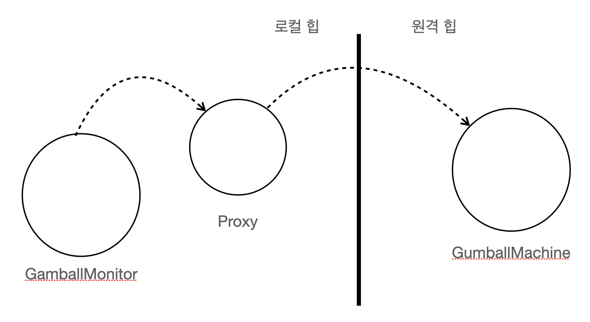
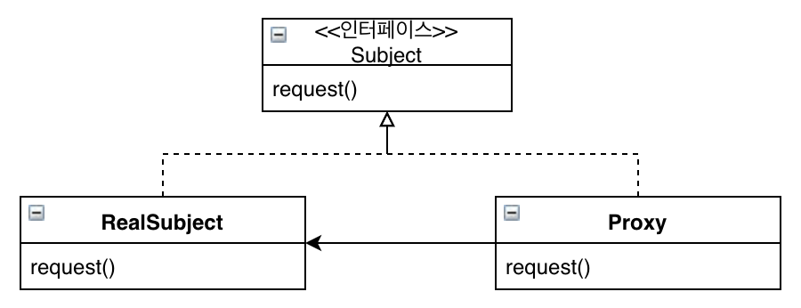
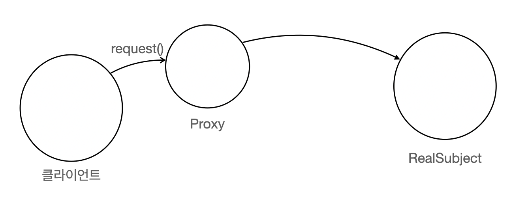
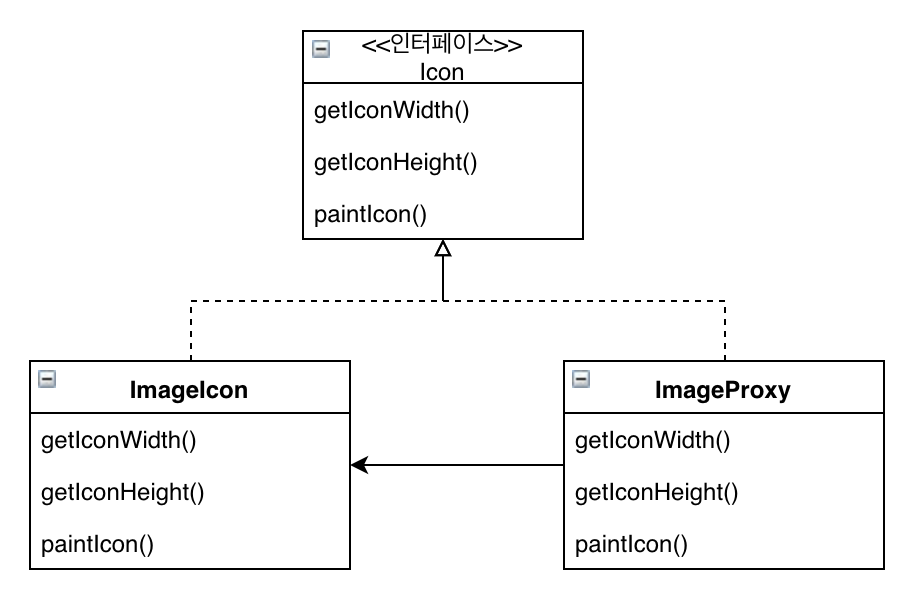
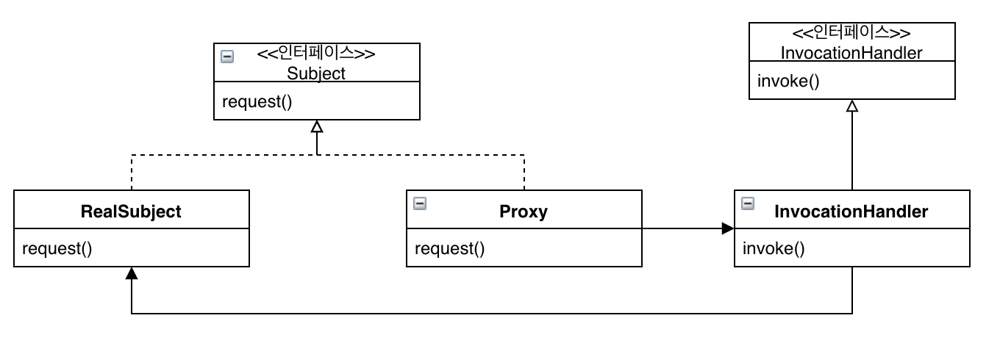

# 프록시 패턴

## 미리보기

프록시 개념: 다른 객체를 대변하는 객체를 만들어서 주 객체에 대한 접근을 제어

* 프록시 패턴을 이용하면 어떤 객체에 대한 대변인을 내세워서 클라이언트의 접근을 제어 가능
* 원격 프록시는 클라이언트와 원격 객체 사이의 데이터 전달 관리
* 가상 프록시는 인스턴스를 만드는 데 많은 비용이 드는 객체에 대한 접근 제어
* 보호 프록시는 호출하는 쪽의 권한에 따라서 객체에 있는 메소드에 대한 접근 제어
* 그 외에도 캐싱 프록시, 동기화 프록시, 방화벽 프록시, 지연 복사 프록시와 같이 다양한 변형된 프록시 패턴 존재
* 프록시 패턴의 구조는 데코레이터 패턴의 구조하고 비슷하지만 그 용도가 다르다는 차이점
* 데코레이터 패턴에서는 객체에 행동을 추가하지만 프록시 패턴에서는 접근을 제어
* 자바에 내장된 프록시 지원 기능을 이용하면 동적 프록시 클래스를 즉석에서 만들어서 원하는 핸들러에서 호출을 처리하도록 가능
* 다른 래퍼를 쓸 때와 마찬가지로 프록시를 쓰면 디자인에 포함되는 클래스와 객체의 수가 증가

## 이해하기

다음은 뽑기 기계의 현재 상태와 재고상태를 파악하는 모니터링용 코드

```java
public class GumballMachine {

    // ...
    String location;

    public GumballMachine(String location, int count) {
        // ...
        this.location = location;
    }

    public String getLocation() {
        return location;
    }
}

public class GumballMonitor {

    GumballMachine gumballMachine;

    public GumballMonitor(GumballMachine machine) {
        this.machine = machine;
    }

    public void report() {
        System.out.println("location " + machine.getLocation());
        System.out.println("count " + machine.getCount());
        System.out.println("state " + machine.getState());
    }
}
```

이 코드는 모니터링이 필요한 뽑기기계를 넘겨주기만 하면 됨. 하지만 만일 서로 다른 JVM에 있는 뽑기 기계를 관리하고싶다면?

이때 필요한게 원격 프록시. 프록시를 통해서 진짜 객체를 대신하는 역할을 맡기기. 실제로 데이터가 필요하게 되면 원격 프록시를 이용해서 데이터를 받음

원격 프록시는 원격 객체에 대한 로컬 대변자 역할을 하는데, 여기서 원격 객체란 다른 자바 가상 머신의 힙에서 살고 있는 객체를 뜻함, 로컬 대변자는 어떤 메소드를 호출하면 다른 원격 객체한테 그 메소드 호출을 전달해주는 역할을 맡고 있는 객체



여기서 클라이언트 객체인 모니터 객체에서는 원격 객체의 메소드를 호출하는 것처럼 행동. 하지만 실제로는 로컬 힙에 있는 프록시 객체를 호출. 그러면 프록시 객체는 네트워크 통신과 관련된 저수준 작업을 수행

여기서 네트워크 통신은 자바에 내장된 RMI 라는 기술로 간단하게 절차만 보면

1. 원격 인터페이스 만들기
    * java.rmi.Remote 확장
    * 모든 메소드를 RemoteException을 던지는 메소드로 선언
    * Serializable 선언
2. 서비스 구현 클래스 만들기
    * 원격 인터페이스 구현
    * UnicastRemoteObject 확장
    * RemoteException을 선언하는 인자가 없는 생성자 만들기
    * 서비스를 RMI 레지스트리에 등록
3. 스터브 및 스켈레톤 생성
    * rmic 명령어
4. rmiregistry 실행
5. 서비스 가동

위 절차를 하면 클라이언트에서는 다음과 같은 형태로 원격 프록시를 가져올수가 있음

```java
try {
    MyRemote service = (MyRemote) Naming.lookup("rmi://127.0.0.1/RemoteHello");
    service.sayHello();
} catch (Exception e) {}
```

앞서 설명한 원격 프록시는 프록시 패턴을 구현하는 방법중에 하나로 이 외에도 여러가지 변형된 방법이 존재

* 원격 프록시를 써서 원격 객체에 대한 접근을 제어
* 가상 프록시를 써서 생성하기 힘든 자원에 대한 접근을 제어
* 보호 프록시를 써서 접근 권한이 필요한 자원에 대한 접근을 제어

다음은 프록시 패턴 다이어그램이야.



간단하게 설명하자면, RealSubject와 Proxy의 인터페이스를 제공하는 Subject 인터페이스가 있으므로 RealSubject들어갈 자리에 Proxy를 대신 넣을수가 있음

실제 작업은 RealSubject에서 처리가 되며 Proxy는 객체의 대변인 역할을 하면서 접근을 제어

Proxy에는 RealSubject에 대한 래퍼런스가 있어서, 생성하거나 제거하는 역할을 책임지는 경우도 있고, 클라이언트는 항상 Proxy를 통해서만 RealSubject 데이터를 주고받음

다음 프록시는 가상 프록시로, 프록시 패턴은 다양한 형태로 쓰이지만 기본 프록시 디자인을 따름



가상 프록시는 생성하는데 많은 비용이 드는 객체를 대신하는 역할. 실제로 객체가 필요하기 전까지 객체 생성 지연.

예시로 어떤 이미지를 가져오는 프로그램이 있다고 가정. 이는 네트워크 상태와 인터넷 속도에 따라서 시간이 걸릴수 있기 때문에 불러 오는 동안 "로딩중" 이라는 문구가 나오면 좋음



클래스 다이어그램은 이전에 보았던 원격 프록시랑 똑같이 생겼지만, 여기에서는 프록시가 생성하는데 많은 비용이 필요한 객체를 숨기기 위한 용도로 사용

1. ImageProxy에서는 우선 ImageIcon을 생성하고 네트워크 URL로부터 이미지를 호출
2. 이미지를 가져오는 동안에 "로딩중" 이라는 메시지가 화면에 표시
3. 이미지 로딩이 끝나면 모든 메소드 호출을 이미지 아이콘 객체 전달

다음은 간단한 ImageProxy 코드

```java
class ImageProxy implements Icon {

    ImageIcon imageIcon;
    URL imabeURL;
    Thread retrievalThread;
    boolean retrieving = false;

    public ImageProxy(URL url) { imageURL = url; }

    public int getIconWidth() {
        if (imageIcon != null) {
            return imageIcon.getIconWidth();
        } else {
            return 800;
        }
    }

    // getIconHeight()

    public void paintIcon(final Component c, Graphics g, int x, int y) {
        if (imageIcon != null) {
            imageIcon.paintIcon(c, g, x, y);
        } else {
            g.drawString("Loading");
            if (!retrieving) {
                retrieving = true;
                retrievalThread = new Thread(() -> {
                    try {
                        imageIcon = new ImageIcon(imageURL, "image");
                        c.repaint();
                    } catch(Exception e) {
                        e.printStackTrace();
                    }
                });
            }
            retrievalThread.start();
        }
    }
}
```

이번에는 보호 프록시

자바에는 java.lang.reflect 패키지에 프록시 기능이 내장되어 있어서 프록시 클래스를 만들수 있는데 이는 클래스 실행중에 생성되기 때문에 동적 프록시라고도 불림

다음은 보호 프록시에 클래스 다이어그램



보호 프록시는 두개의 클래스로 구성되어있고, 프록시 객체에 대한 모든 메소드 호출을 전달 받는 InvocationHandler를 제공해야 함

보호 프록시 이해를 위해서 결혼 정보 업체 서비스를 예시로 보면

```java
public interface PersonBean {

    String getName();
    int getHotOrNotRating();

    void setName(String name);
    void setHotOrNotRating(int rating);
}

public class PersonBeanImpl implements PersonBean {

    @Getter
    String name;
    int rating;
    int ratingCount = 0;

    public int getHotOrNotRating() {
        if (ratingCount == 0) return 0;
        return (rating / ratingCount);
    }

    public void setHotOrNotRating(int rating) {
        this.rating += rating;
        this.ratingCount++;
    }
}
```

사람은 각각 선호도라는 점수를 매기는데, 문제는 자신이 자기 선호도를 직접 매길수 있다는 점. 이런 경우에 보호 프록시를 사용해서 접근 권한을 제어. 이 경우에는 고객이 자기 정보를 직접 수정할수는 있지만, 선호도는 매길수 없게 하고, 그 외 다른 사람은 정보를 열람만 하고 선호도를 매길수 있어야 함

이제 앞서 보았던 자바 API 동적 프록시 기술을 활용해서 프록시를 만들면

먼저 해야할일은 InvocationHandler를 두개 만들어야함. 하나는 본인을 위한 핸들러, 하나는 타인을 위한 핸들러. 메소드는 invoke() 하나만 구현

만일 프록시의 setHotOrNotRating() 메소드를 호출되었다고 가정해보면 필요한 정보는 호출한 프록시, 메소드, 인자가 필요. 이 정보가 invoke()에 들어감. 그리고 Subject 메소드를 호출

다음은 보호 프록시의 예시 코드

```java
import java.lang.reflect.*;

public class OwnerInvocationHandler implements InvocationHandler {

    PersonBean person;

    public OwnerInvocationHandler(PersonBean person) {
        this.person = person;
    }

    public Object invoke(Object proxy, Method method, Object[] args) throws IllegalAccessException {

        try {
            if (method.getName().startsWith("get")) {
                return method.invoke(person, args);
            } else if (method.getName().equals("setHotOrNotRating")) {
                throw new IllegalAccessException();
            } else if (method.getName().startsWith("set")) {
                return method.invoke(person, args);
            }
        } catch (InvocationTargetException e) {
            e.printStackTrace();
        }
        return null;
    }
}
```

이제 동적으로 프록시 클래스를 생성하고 프록시 객체 인스턴스를 만들어야하는데, 우선 PersonBean을 인자로 받고 본인용 프록시를 만들기 위한 메소드를 보면

```java
PersonBean getOwnerProxy(PersonBean person) {
    return (PersonBean) Proxy.newProxyInstance(person.getClass().getClassLoader(), person.getClass().getInterfaces(), new OwnerInvocationHandler(person));
}
```

프록시 클래스에 있는 newProxyInstance 메소드를 통해서 프록시를 생성. 이때 클래스 로더, 인터페이스, 호출 핸들러를 전달

지금까지 보았던 프록시 외에 간단하게 확인

1. 방화벽 프록시: 네트워크 자원에 대한 접근을 제어
2. 스마트 레퍼런스 프록시: 주 객체가 참조될 때마다 추가 행동을 제공 ex) 레퍼런스 개수 세기
3. 캐싱 프록시: 비용이 많이 드는 작업의 결과를 임시로 저장
4. 동기화 프록시: 분산 환경에서 객체의 접근에 대한 동기화된 접근 제어
5. 복잡도 숨김 프록시: 복잡한 클래스들의 집합에 대한 접근제어, 퍼사드 프록시라고도 부름
6. 지연 복사 프록시: 클라이언트에서 필요로 할 때까지 객체가 복사되는 것을 지연시킴으로써 객체의 복사 제어
