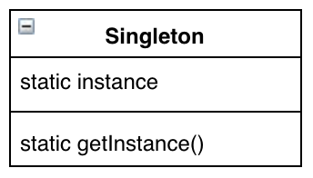
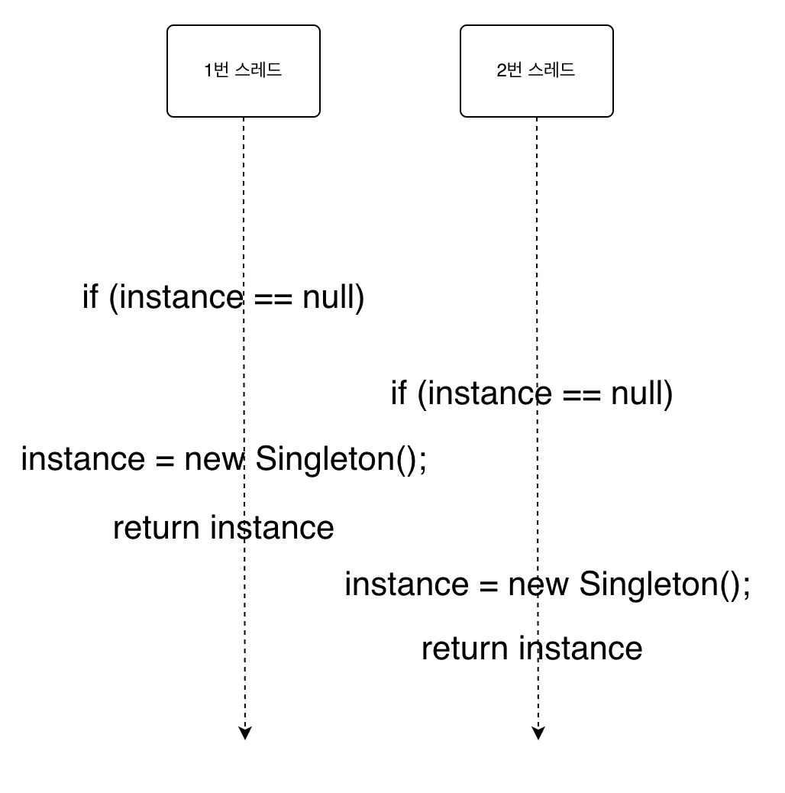

# 싱글톤 패턴

## 미리보기

개념: 클래스 인스턴스 하나만 만들어지도록 하고, 그 인스턴스에 대한 전역 접근을 제공

* 어떤 클래스 싱글턴 패턴을 적용하면 애플리케이션에 그 클래스의 인스턴스가 최대 한개까지만 존재
* 싱글턴 패턴을 이용하면 유일한 인스턴스를 어디서든지 접근 가능
* 자바에서 싱글턴 패턴을 구현할 때는 private 생성자와 정적 메소드, 정적 변수를 사용
* 다중 스레드를 사용하는 애플리케이션에서는 속도와 자원 문제를 파악해보고 적절한 구현법을 사용(사실상 모든 애플리케이션에서 멀티스레딩을 쓸 수 있다고 생각)
* 클래스 로더가 여러 개 있으면 싱글턴이 제대로 작동하지 않고, 여러 개의 인스턴스가 생길 수 있음

## 이해하기

객체중에는 스레드 풀 이더라던가 캐시, 레지스트리 설정을 처리하는 객체 같은 하나만 있으면 되는 것이 많이 있는데, 만일 이런게 두개 이상 만들어 진다면 불필요하게 자원을 잡아먹는다던지, 서로 동기화가 안되는 문제가 발생 가능

싱글톤 패턴은 특정 클래스에 대해서 객체 인스턴스가 하나만 만들어질 수 있도록 해주는 패턴. 이를 사용하면 전역 변수를 사용할 때와 마찬가지로 객체 인스턴스를 어디서든지 액세스 가능하며 전역 변수의 단점을 감수해야하는것도 아님

대표적인 전역 변수의 단점은 애플리케이션이 시작할 때 객체가 생성이 될텐데, 이 객체를 사용하지 않는다면 이는 자원 낭비가 되는 부분

일반적으로 객체는 다음과 같이 생성

```java
new MyObject();
```

이는 생성자를 public으로 선언을 했기 때문. 만일 다음과 같이 선언을 하면 어떻게 될까?

```java
public class MyObject {

    private MyObject() {}
}
```

생성자가 private으로 선언되어 있기 때문에 MyObject에 있는 코드에서만 호출 가능, 그러면 객체의 인스턴스를 절대 만들수 없는데 이는 인스턴스가 없다는 것은 private 도 호출할 수 없다는 것을 의미

그래서 인스턴스가 없어도 호출할 방법이 있어야하는데 이게 바로 정적 메소드

```java
public class MyObject {

    private MyObject() {}

    public static MyObject getInstance() {
        return new MyObject();
    }
}
```

여기서 객체 인스턴스가 오직 하나만 만들도록 하면 고전적인 싱글톤 패턴 구현

```java
public class Singleton {
    // 여기에 하나뿐인 인스턴스가 저장
    private static Singleton instance;

    private Singleton() {}

    // 생성자를 통해 객체를 만드는것이 아닌 인스턴스를 달라고 요청
    public static Singleton getInstance() {
        if (instance == null) { // 아직 인스턴스가 만들어지지 않았다면
            instance = new Singleton(); // private로 선언된 생성자를 통해 생성
        }
        return instance;
    }
}
```

개념: 싱글톤 패턴은 해당 클래스의 인스턴스가 하나만 만들어지고, 어디서든지 그 인스턴스에 접근할 수 있도록 하기 위한 패턴

싱글톤 패턴은 클래스에서 자신의 단 하나뿐인 인스턴스를 관리하도록 만들면 됨, 그리고 다른 클래스에서 자신의 인스턴스를 추가로 만들지 못하도록 해야함

추가로 어디서든지 그 인스턴스에 접근할 수 있도록 해야함

다음은 클래스 다이어그램



앞서 보여주었던 고전적인 싱글톤 패턴은 치명적인 문제점이 존재. 바로 멀티 스레드 환경에서 발생는데, 두 개의 스레드가 인스턴스를 달라고 할때 인스턴스가 존재하지 않는다면 둘다 생성하려할거고 서로 다른 인스턴스를 받게 됨



이는 간단하게 synchronized 키워드를 사용해서 해결 가능

```java
public static synchronized Singleton getInstance() {
    if (instance == null) {
        instance = new Singleton();
    }
    return instance;
}
```

하지만 이는 객체 인스턴스를 달라고 요청할때마다 다른 스레드는 대기해야하는 문제가 발생. 물론 이 정도 오버헤드가 중요하지 않는다면 상관은 없음 (메소드를 동기화하면 성능이 약 100배 저하), 다른 대안이 필요하다면

다음과 같이 인스턴스를 필요할때 생성하는것이 아닌 처음부터 만드는 방법도 존재

```java
private static Singleton instance = new Singleton();
```

이 방법은 객체를 사용하지 않더라도 만들어야하는 단점

마지막 방법은 DCL(Double-checking Locking) 기법

```java
public class Singleton {
    private volatile static Singleton = instance;

    private Singleton() {}

    public static Singleton getInstance() {
        if (instance == null) {
            synchronized (Singleton.class) {
                if (instance == null) {
                    instance = new Singleton();
                }
            }
        }
    }
}
```

이 방법은 인스턴스가 생성 되지 않았을 때만 동기화를 하고, 블록으로 들어온 이후에도 다시 인스턴스를 체크
