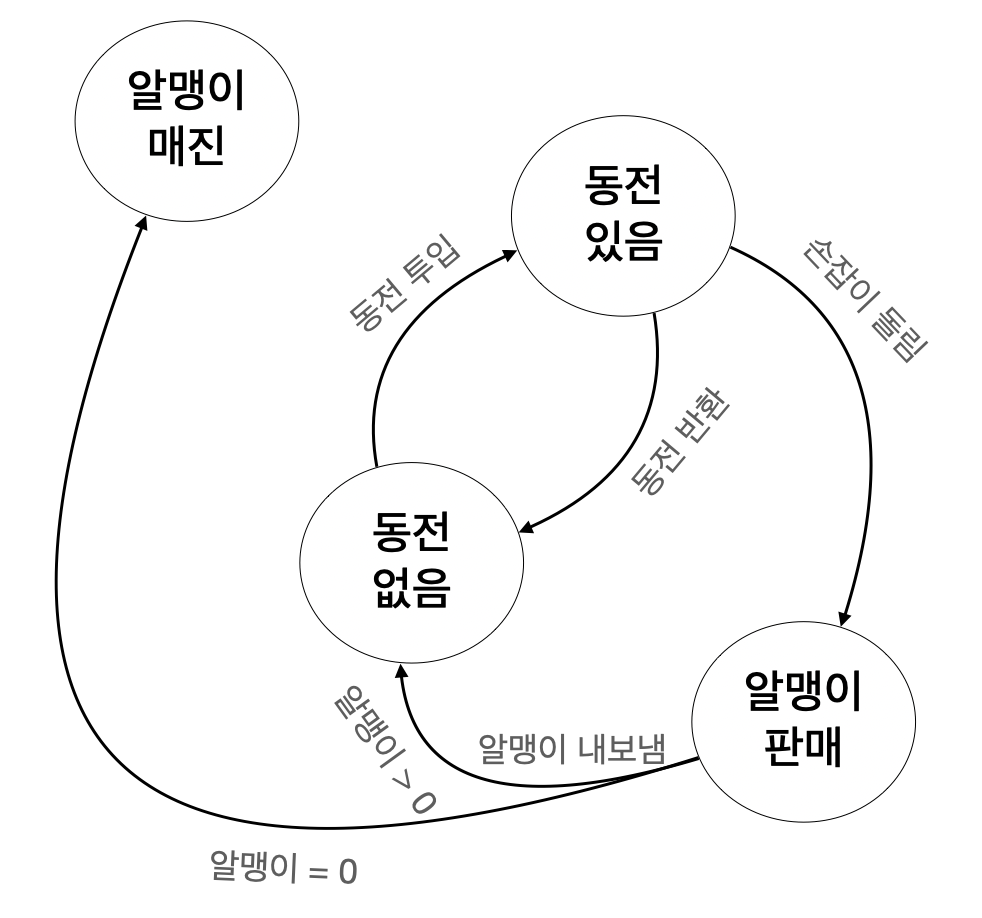
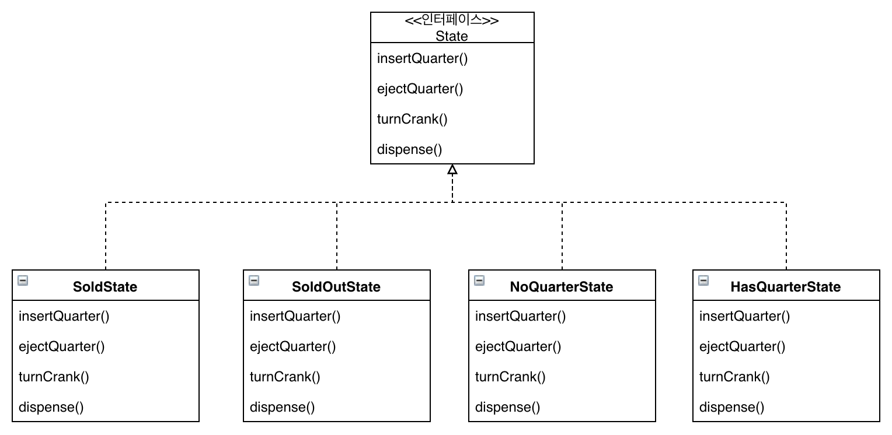
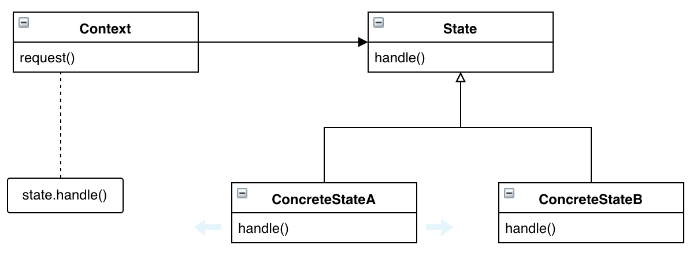

# 스테이트 패턴

## 미리보기

개념: 내부 상태가 바뀜에 따라 객체의 행동이 변경, 마치 객체의 클래스가 바뀌는 것 같은 결과를 얻음

* 스테이트 패턴을 이용하면 내부 상태를 바탕으로 여러 가지 서로 다른 행동을 사용 가능
* 스테이트 패턴을 사용하면 프로시저형 상태 기계를 쓸 때와는 달리 각 상태를 클래스를 이용하여 표현
* Context 객체에서는 현재 상태에게 행동을 위임
* 각 상태를 클래스로 캡슐화함으로써 나중에 변경시켜야 하는 내용을 국지화
* 스테이트 패턴과 스트래티지 패턴의 클래스 다이어그램은 똑같지만 그 용도는 서로 다름
* 스트래티지 패턴에서는 일반적으로 행동 또는 알고리즘을 Context 클래스를 만들 때 설정
* 스테이트 패턴을 이용하면 Context의 내부 상태가 바뀜에 따라 알아서 행동이 변경 가능
* 상태 전환은 State 클래스에 의해서 제어할 수도 있고, Context 클래스에 의해서 제어 가능
* 스테이트 패턴을 이용하면 보통 디자인에 필요한 클래스의 개수가 증가
* State 클래스를 여러 Context 객체의 인스턴스에서 공유하도록 디자인 가능

## 이해하기

다음과 같은 상태 다이어그램으로 작동하는 뽑기 기계기 있을때 이를 코드로 구현하면 어떻게 구현할지 고민



상태 다이어그램에 대해서 간략하게 설명하면 동그라미는 상태를, 화살표는 행동을 뜻함 만일 동전없음 상태에서 동전을 투입하면 동전 있음 상태로 변한다로 이해

상태 기계에 대해서 구현하는 방법에 대해 살펴보면

먼저 상태를 모아봐야함 여기서는 동전없음 상태, 동전있음 상태, 알맹이판매 상태, 알맹이매진 상태가 존재

그리고 현재 상태를 저장하기위한 인스턴스 변수를 만들고 각 상태의 값을 정의

```java
final static int SOLD_OUT = 0;
final static int NO_QUARTER = 1;
final static int HAS_QUARTER = 2;
final static int SOLD = 3;
```

다음은 행동을 모아보면, 동전 투입, 동전 반환, 손잡이 돌림, 알맹이 내보냄이 존재

이제 상태 기계 역할을 하는 클래스에서 각 행동을 구현할 때 조건문을 써서 상태별로 어떤 작업을 처리할지 결정하면 끝. 아래는 동전 투입 행동에 대한 예시

```java
public void insertQuarter() {
    if (state == HAS_QUARTER) {
        System.out.println("동전은 한 개만 넣어주세요.");
    } else if (state == SOLD_OUT) {
        System.out.println("매진되었습니다. 다음 기회에 이용해주새요.");
    } else if (state == SOLD) {
        System.out.println("잠시만 기다려 주세요. 알맹이가 배출되고 있습니다.");
    } else if (state == NO_QUARTER) {
        state = HAS_QUARTER;
        System.out.println("동전이 투입되었습니다.");
    }
}
```

예시를 바탕으로 뽑기 기계를 구현해보면 다음과 같은 코드 구현

```java
public class GumballMachine {

    final static int SOLD_OUT = 0;
    final static int NO_QUARTER = 1;
    final static int HAS_QUARTER = 2;
    final static int SOLD = 3;

    int state = SOLD_OUT;
    int count = 0;

    public GumballMachine(int count) {
        this.count = count;
        if (count > 0) {
            state = NO_QUARTER;
        }
    }

    public void insertQuarter() {
    if (state == HAS_QUARTER) {
        System.out.println("동전은 한 개만 넣어주세요.");
    } else if (state == SOLD_OUT) {
        System.out.println("매진되었습니다. 다음 기회에 이용해주새요.");
    } else if (state == SOLD) {
        System.out.println("잠시만 기다려 주세요. 알맹이가 배출되고 있습니다.");
    } else if (state == NO_QUARTER) {
        state = HAS_QUARTER;
        System.out.println("동전이 투입되었습니다.");
    }

    public void ejectQuarter() {
        // ...
    }

    public void turnCrank() {
        // ...
    }

    public void dispense() {
        // ...
    }
}
```

딱히 특이한 점은 없지만 요구사항이 하나 더 추가되었다고 생각. 10분의 1의 확률로 손잡이를 돌릴때 두 개가 나오는 요구사항이 추가되었다면 어디를 수정해야할까? 모든 행동에 새로 추가된 상태를 넣어하고, 손잡이를 돌릴때를 위한 메소드에 대한 변경이 많아짐

현재 위 코드는 다른 기능을 추가하는 과정에서 기존 코드에 없던 새로운 버그가 생길 가능성이 높으며, 변경되는 부분에 대해서 캡슐화도 하지 않음

기존 코드를 그대로 활용하는 대신 새로운 디자인이 필요. 이때 필요한게 스테이트 패턴

우선 뽑기 기계와 관련된 모든 행동에 대한 메소드가 들어있는 State 인터페이스를 정의하고, 기계의 모든 상태에 대해서 상태 클래스를 구현. 그러면 이제 그 상태에 해당하는 상태 클래스가 모든 작업을 책임지게 됨



예시로 하나의 상태를 보면 NoQuarterState 클래스는 동전이 들어오면 HasQuarterState로 변경이 되면 되.

```java
public class NoQuarterState implements State {

    GumballMachine gumballMachine;

    public NoQuarterState(GumballMachine gumballMachine) {
        this.gumballMachine = gumballMachine;
    }

    public void insertQuarter() {
        System.out.println("동전을 넣으셨습니다.");
        gumballMachine.setState(gumballMachine.getHasQuarterState());
    }

    public void ejectQuarter() {
        System.out.println("동전을 넣어주세요.");
    }

    public void turnCrank() {
        System.out.println("동전을 넣어주세요.");
    }

    public void dispense() {
        System.out.println("동전을 넣어주세요.");
    }
}
```

다음은 뽑기 기계의 코드 일부분

```java
public class GumballMachine {

    State soldOutState;
    State noQuarterState;
    State hasQuarterState;
    State soldState;

    State state = soldOutState;
    int count = 0;

    public GumballMachine(int numberGumballs) {
        soldOutState = new SoldOutState(this);
        noQuarterState = new NoQuarterState(this);
        hasQuarterState = new HasQuarterState(this);
        soldState = new SoldState(this);

        this.count = numberGumballs;
        if (numberGumballs > 0) {
            state = noQuarterState;
        }
    }

    public void insertQuarter() {
        state.insertQuarter();
    }

    public void ejectQuarter() {
        state.ejectQuarter();
    }
}
```

지금까지 한 일을 정리해보면

1. 각 상태의 행동을 별개의 클래스로 분리
2. 관리하기 힘든 if 선언문 제거
3. 각 상태를 변경에 대해서 닫혀 있도록 하면서 새로운 상태 클래스를 추가하는 확장에 대해서는 열려있도록 변경 (OCP)
4. 초기 상태다이어그램에 가까우면서도 이해하기 쉬운 코드

이것이 스테이트 패턴, 이 패턴은 상태를 별도의 클래스로 캡슐화한 다음 현재 상태를 나타내는 객체에게 행동을 위임하기 때문에 내부 상태가 바뀜에 따라서 행동이 달라지게 됨

다음은 스테이트 패턴의 클래스 다이어그램



스테이트 패턴을 보면 스트래티지 패턴과 똑같은 다이어그램이라고 생각할 수 있음. 다이어그램이 똑같은건 맞지만 용도에 있어서 차이가 존재

스테이트 패턴은 상태 객체에 행동이 캡슐화되고, 상황에 따라 Context 객체에서 상태 객체 중 한 객체에게 모든 행동을 맡기게 됨, 즉 클라이언트는 상태 객체에 대해서 아무것도 몰라도 됨

반면에 스트래티지 패턴은 클라이언트가 컨텍스트 객체에게 어떤 객체를 쓸지를 지정이 필요. 이는 실행시에 전략 객체를 변경할 수 있는 유연성을 제공하기 위한 용도

앞서 말한 열번에 한번 꼴로 알맹이를 더 주는 로직이 추가되었다고 생각하면 다음과 같이 구현

```java
public class GumballMachine {
    
    State soldOutState;
    State noQuarterState;
    State hasQuarterState;
    State soldState;
    State winnerState; // WinnerState를 추가하고 생성자에서 생성하는 부분 추가

    // ...
}

public class WinnerState implements State {

    // ...

    public void dispense() {
        // 알맹이를 하나 더 주는 로직
    }
}

public class HasQuarterState implements State {

    // ...

    public void turnCrank() {
        // 10분의 1로 WinnerState로 변경하는 로직 추가
    }
}
```
