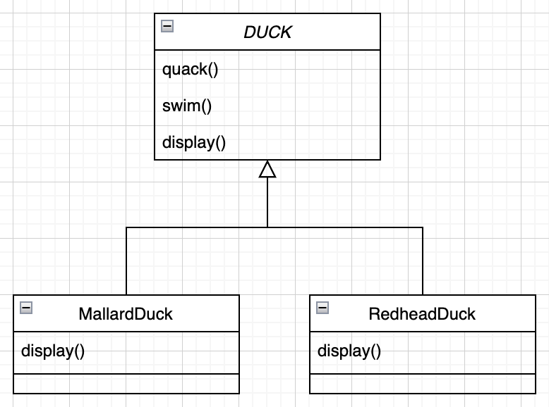
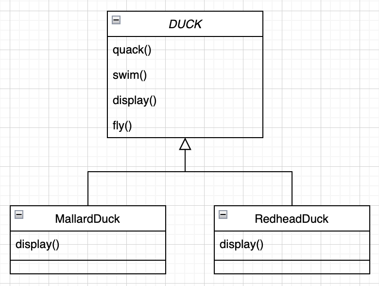
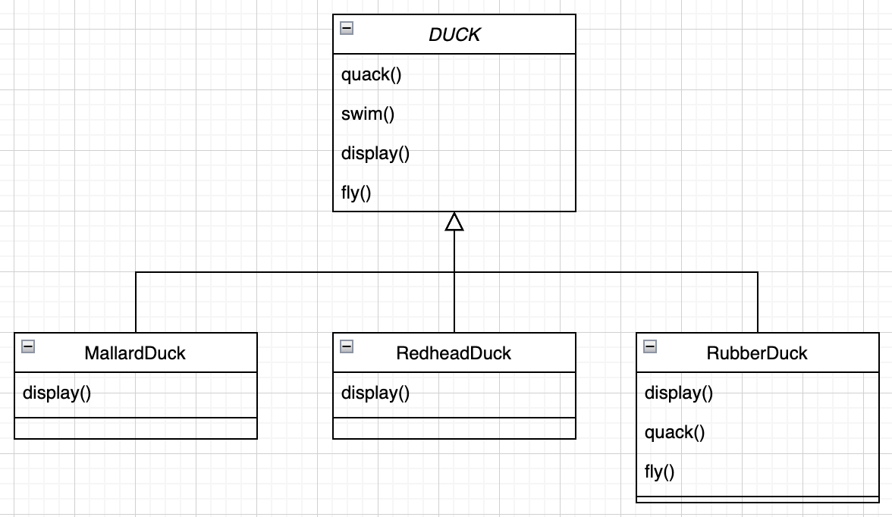
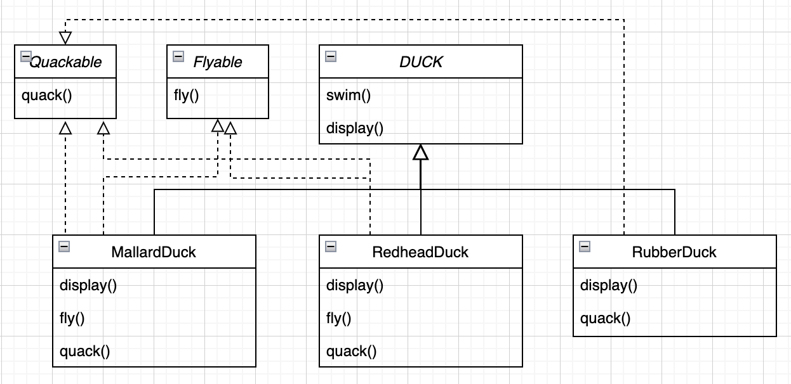
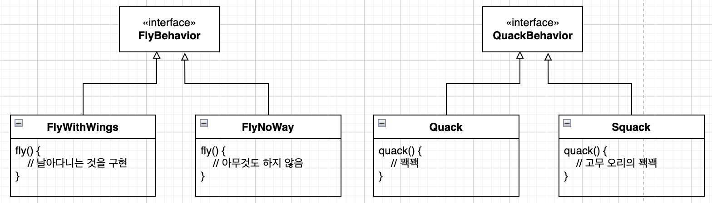

# 전략 패턴

## 미리보기

개념 : 알고리즘군을 정의하고 각각을 캡슐화하여 교환해서 사용할 수 있도록 만들고, 알고리즘을 사용하는 클라이언트와는 독립적으로 알고리즘을 변경할수 있게 해주는 패턴

* 객체지향 기초지식만 가지고는 훌륭한 객체지향 디자이너가 될 수 없음
* 훌륭한 객체지향 디자인이라면 재사용성, 확장성, 관리에 용이성을 갖춰야함
* 패턴은 훌륭한 객체지향 디자인 품질을 갖추고 있는 시스템을 만드는 방법을 제공
* 패턴은 검증받은 객체지향 경험의 산물
* 패턴이 코드를 바로 제공해주는 것은 아니지만, 디자인 문제에 대한 일반적인 해법을 제공하고, 특정 애플리케이션에 패턴을 적용하는 것은 우리가 해야할 일
* 패턴은 발명되는 것이 아니라 발견되는 것
* 대부분의 패턴과 원칙은 소프트웨어의 변경 문제와 관련
* 대부분의 패턴은 시스템의 일부분을 나머지 부분과 무관하게 변경하는 방법을 제공
* 많은 경우에 시스템에서 바뀌는 부분을 골라내서 캡슐화
* 패턴은 다른 개발자들과의 의사소통의 가치를 극대화 시킬 수 있는 전문 용어 역할

## 이해하기

다양한 오리가 나타나는 게임을 보면, 오리는 수영도 하고 꽥꽥도 함. 초기 디자인은 Duck이라는 수퍼클래스를 두고 이 클래스를 확장하여 다른 모든 종류의 오리를 만듬



모든 오리들이 소리를 내고 헤엄을 칠 수 있기에 수퍼클래스에서 구현을 하고 각각의 오리마다 다른 형태의 자식 클래스에서 구현. 추가로 다른 유형의 오리가 필요하다면 상속을 받아서 필요한 부분을 구현

이때 오리가 날수있다는 요구사항이 생겼다고 가정. 단순하게 수퍼클래스에 메소드를 추가하는 방법으로 구현



하지만 문제가 발생, Duck의 상속을 받는 모든 오리가 날 수 있는것이 아님 일부 서브클래스에서도 fly() 메소드가 추가가 되서 모든 오리가 날 수 있게 된것. 날 수 있는 오리에 fly() 메소드를 추가하는 방법보다는 날 수 없는 오리의 fly() 메소드를 오버라이드 하는 방법이 더 좋아보임



하지만 이 구조는 치명적인 단점이 존재. 수퍼클래스에서 공통 로직을 구현하고 이를 자식클래스에서 사용할려고 했지만, 자식클래스를 작성할때마다 각각의 공통기능에서 사용 여부를 판단한다음 다시 구현을 해야한다는 점

예를 들어 나무로 된 가짜 오리라고 한다면 소리도 못내고, 수영도 못하고, 형태도 다시 구현해야하고, 날 수도 없음. 또한 변화에 대해서도 불리함. 공통 로직인 swim() 을 수정하게 된다면 모든 자식 클래스를 확인해야함. 상속을 통해 오히려 더 복잡해짐

그러면 상속이 아닌 인터페이스를 활용하는 방법은? 인터페이스를 사용한다면 다음과 같은 구조가 나옴



이러면 날수있는 오리들만 Flyable 인터페이스를 구현하면 되. 하지만 이 또한 좋은 방법이 아닌게 중복 코드가 발생하며 오리의 동작이 많아지면 많아질수록 구현해야하는 코드량이 많아짐. 이는 코드 관리면에서도 나쁜 영향

즉, 상속과 인터페이스는 코드를 수정하게 되면 기존 코드에 미치는 영향이 많이지게 됨. 이러한 변화를 적게 발생하게 하는것이 모든 소프트웨어 개발에 있어서 중요한 부분

이런 상황에서 어울리는 디자인 원칙이 존재

> 애플리케이션에서 달라지는 부분을 찾아내고, 달라지지 않는 부분으로부터 분리 시킨다

코드에 새로운 요구사항이 있을 때마다 바뀌는 부분이 있다면, 그 행동을 바뀌지 않는 다른 부분으로부터 골라내서 분리해야한다는 것을 알수있으며 이 원칙은 다음과 같이 생각 가능

> 바뀌는 부분은 따로 뽑아서 캡슐화 시킨다. 그렇게 하면 나중에 바뀌지 않는 부분에는 영향을 미치지 않은 채로 그 부분만 고치거나 확장할 수 있다

이 개념은 매우 간단하지만 다른 모든 디자인 패턴의 기반을 이루는 원칙

이제 오리에서 바뀌는 부분과 그렇지 않은 부분을 분리. Duck 클래스는 fly() 와 quack() 를 제외하면 잘 작동하고, 나머지 부분은 자주 달라지거나 바뀌지 않아. 그러므로 몇 가지 자잘한 변경 사항을 제외하면 Duck 클래스는 그대로 두는 게 좋겠지.

변하는 부분과 변하지 않는 부분을 분리하려면 두 개의 클래스 집합으로 만들어야해. 하나는 나는 것과 관련된 집합이고 다른 하나는 꽥꽥거리는 것과 관련된 부분으로 각 클래스 집합에는 각각의 행동을 구현한 것을 전부 넣어주면 됨. 예를 들면 꽥꽥거리는 것을 구현하는 클래스 하나, 삑삑거리는 것을 구현하는 클래스 하나, 아무 소리도 내지 않는 것 하나를 만드는 것

즉, fly() 와 quack()는 오리마다 달라지는 부분이고 이러한 메소드를 Duck 클래스로부터 끄집어내서 각 행동을 나타내는 집합을 새로 만드는 것

우선 최대한 유연하게 만들면서 Duck 인스턴스에 행동을 할당할 수 있어야 함. 예를 들어 MallardDuck 인스턴스를 새로 만들고 특정 형식의 행동으로 초기화 하거나 동적으로 행동을 할당하는 형태

다음과 같은 디자인 원칙을 적용

> 구현이 아닌 인터페이스에 맞춰서 프로그래밍한다.

각 행동은 인터페이스로 표현하고 행동을 구현할 때 이런 인터페이스를 구현

나는 행동과 꽥꽥거리는 행동은 이제 Duck 클래스에서 구현하지 않고 대신 특정 행동만을 목적으로 하는 클래스의 집합을 생성


이 방법은 행동을 Duck 클래스에서 구체적으로 구현하거나 서브클래스에서 자체에서 구현하는 방법하고는 상반된 방법. 전에 두 방법은 특정 구현에 의존했었고, 특정 구현만 써야만 해서 행동을 변경할 여지가 없었음

새로운 디자인을 사용하면 Duck의 서브클래스에서는 인터페이스로 표현되는 행동을 사용. 따라서 행동을 실제로 구현한 것은 Duck 서브클래스에 국한되지 않음

여기서 FlyBehavior를 왜 인터페이스를 사용하는지 궁금할수도 있는데 여기서 핵심은 실제 실행시에 쓰이는 객체가 코드에 의해서 고정되지 않도록 어떤 상위 형식에 맞춰서 프로그래밍함으로써 다형성을 활용해야 한다는 점

예를 들어 Animal 이라는 추상 클래스가 있고, 그 밑에 Dog와 Cat이라는 구상 클래스가 있다고 가정할때 구현에 맞춰서 프로그래밍 한다면 다음과 같음

```java
Dog d = new Dog();
d.bark();
```

하지만 인터페이스에 맞춰서 구현한다면 다음과 같이 구현

```java
Animal animal = new Dog();
animal.makeSound();

Animal animal2 = new Cat();
animal.makeSound();
```

더 바람직한 방법은 상위 형식의 인스턴스를 만드는 과정을 구체적으로 구현된 객체를 실행시에 대입. 이는 Animal 의 어떤 형식인지 모르지만 반응 가능

```java
Animal animal = getAnimal(type);
animal.makeSound();
```

그러면 이제 Duck의 행동을 구현하면 다음과 같은 형태



이런식으로 디자인 하면 다른 형식의 객체에서도 나는 행동과 꽥꽥거리는 행동을 재사용할 수 있고, 기존 행동 클래스를 수정하지 않고도 새로운 행동을 추가 가능

이제 Duck 행동을 통합


Duck 클래스에는 이제 두 개의 인터페이스 형식의 인스턴스 변수가 추가가 되. 이 변수는 특정 행동에 대한 래퍼런스를 다형적으로 설정하고 나는 행동과 꽥꽥거리는 행동은 인터페이스로 옮겼기 때문에 fly() 와 quack() 대신 performQuack(), performFly()라는 메소드를 추가했어.

이제 performQuack() 와 performFly() 를 구현해보면

```java
public abstract class Duck {
    QuackBehavior quackBehavior;
    FlyBehavior flyBehavior;

    public void performQuack() {
        quackBehavior.quack();
    }

    public void performFly() {
        flyBehavior.fly();
    }
}
```

여기서 중요한점은 어떤 행동이 구현됬는지는 신경 쓸 필요는 없다는 점. quack(), fly()를 실행시킬 줄 안다는 것이 중요할 뿐

그러면 이제 MallardDuck 클래스를 만들어보면

```java
public class MallardDuck extends Duck {

    public MallardDuck() {
        quackBehavior = new Quack();
        flyBehavior = new FlyWithWings();
    }

    public void display() {
        System.out.println("저는 물오리 입니다.");
    }
}
```

MallardDuck 인스턴스를 만들때 Duck로 부터 상속받은 인스턴스 변수에 QuackBehavior를 구현한 구상 클래스를 인스턴스 변수에 대입하면 MallardDuck의 인스턴스에서 performQuack() 를 실행하면 QuackBehavior를 구현한 quack() 가 호출

만일 동적으로 오리의 행동을 변경하고 싶다면 setter 메서드를 통해 변경만 해주면 기존에 대신 호출을 해주던 performQuack(), performFly()는 수정을 안해줘도 됨

각 오리에는 FlyBehavior와 QuackBehavior가 있으며 각각 행동을 위임 받고 이런 식으로 합치는 것을 구성(composition)을 이용하는 것이라 함. 오리 클래스에서는 행동을 상속받는 대신, 올바른 행동 객체로 구성됨으로써 행동을 부여받음

> 상속보다는 구성을 활용한다.

지금까지 봤던 것처럼, 구성을 이용하여 시스템을 만들면 유연성을 크게 향상시킬 수 있음

관리가 용이한 객체지향 시스템을 만드는 비결중 하나는 "나중에 어떻게 바뀔 것인지" 생각해보는 것
