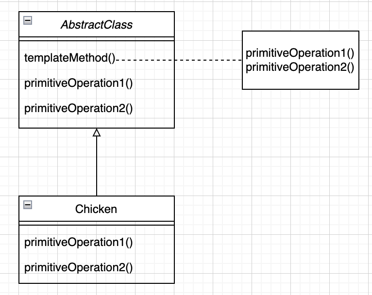
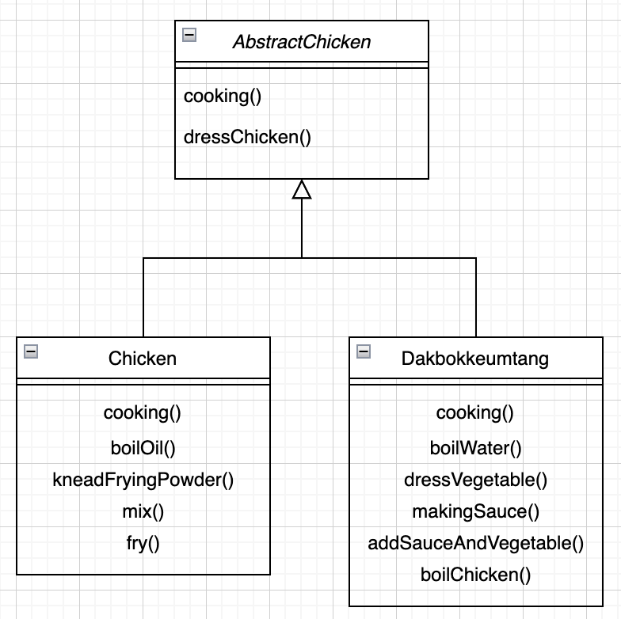
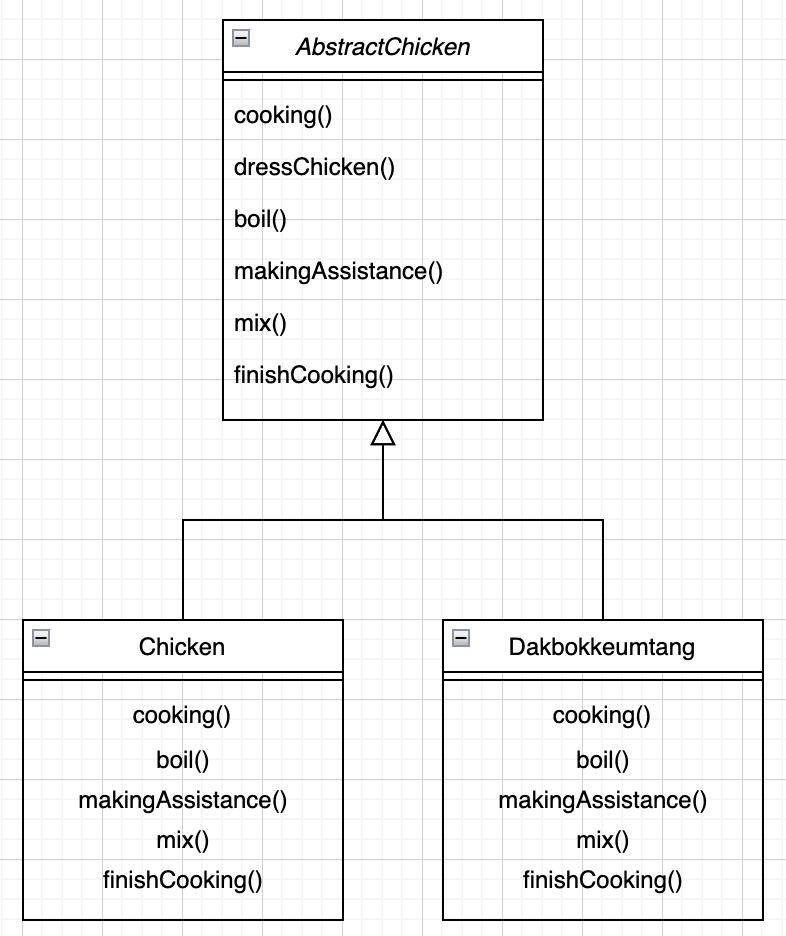
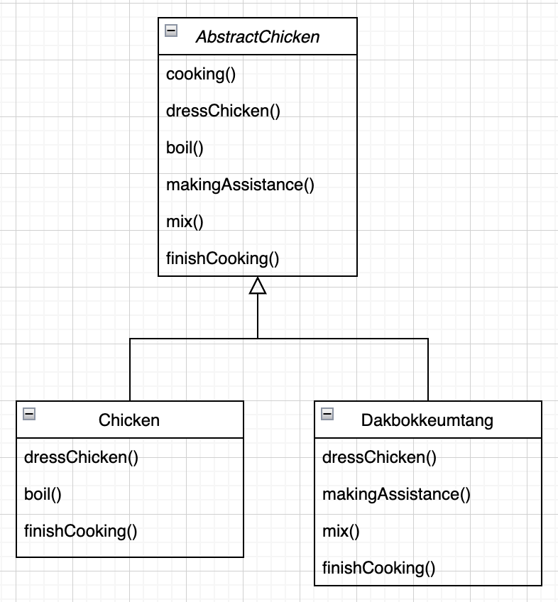

# 템플릿 메소드 패턴

## 미리보기

개념 : 알고리즘의 골격을 정의하고 알고리즘의 여러 단계 중 일부를 서브클래스에서 구현하는 패턴

이런 상황에서 사용을 고려

* 규칙적인 프로세스가 있을때
* 프로세스의 세부 내용의 변경 가능성이 있을때



code

```java
abstract class AbstractTemplate {

    public final void templateMethod() {
        primitiveOperation1();
        primitiveOperation2();
        primitiveOperation3();
        hook();
    }

    abstract protected void primitiveOperation1();
    abstract protected void primitiveOperation2();
    abstract protected void primitiveOperation3();
    abstract protected void hook() {}
}

public class ATemplate extends AbstractTemplate {

    @Override
    protected void primitiveOperation1() {}

    @Override
    protected void primitiveOperation2() {}

    @Override
    protected void primitiveOperation3() {}
}

public class Main {

    public static void main() {
        AbstractTemplate template = new ATemplate();
        template.templateMethod();
    }
}
```

## 이해하기

오늘 부터 닭 요리 전문점을 창업해보면 먼저 메뉴로는 치킨, 닭볶음탕 두가지로 정하고 각각의 요리법을 적어보면

치킨

1. 닭을 손질한다.
2. 기름을 끓인다.
3. 튀김 가루를 반죽한다.
4. 손질된 닭을 튀김가루에 버무린다.
5. 닭을 기름에 튀긴다.

백숙

1. 닭을 손질한다.
2. 물을 끓인다.
3. 야채를 손질한다.
4. 소스를 만든다.
5. 끓는 물에 소스와 야채를 넣는다.
6. 닭을 끓는 물에 넣는다.

먼가 비슷하면서도 다른거같은 요리법. 그럼 먼저 치킨 요리법을 코드로 옮겨 보면

```java
public class Chicken {

    public void cooking() {
        dressChicken();
        boilOil();
        kneadFryingPowder();
        mix();
        fry();
    }

    private void dressChicken() {
        System.out.println("닭을 손질한다.");
    }
    private void boilOil() {
        System.out.println("기름을 끓인다.");
    }
    private void kneadFryingPowder() {
        System.out.println("튀김가루를 반죽한다.");
    }
    private void mix() {
        System.out.println("튀김가루와 닭을 버무린다.");
    }
    private void fry() {
        System.out.println("닭을 기름에 튀긴다.");
    }
}
```

코드를 보면 cooking 이라는 메소드에 각각의 요리에 필요한 단계를 호출고 각 단계는 구체적으로 요리를 구현

다음은 닭볶음탕

```java
public class Dakbokkeumtang {

    public void cooking() {
        dressChicken();
        boilWater();
        dressVegetable();
        makingSauce();
        addSauceAndVegetable();
        boilChicken();
    }

    private void dressChicken() {
        System.out.println("닭을 손질한다.");
    }
    private void boilWater() {
        System.out.println("물을 끓인다.");
    }
    private void dressVegetable() {
        System.out.println("야채를 손질한다.");
    }
    private void makingSauce() {
        System.out.println("소스를 만든다.");
    }
    private void addSauceAndVegetable() {
        System.out.println("소스와 야채를 끓는 물에 넣는다.");
    }
    private void boilChicken() {
        System.out.println("닭을 끓는 물에 넣는다.");
    }
}
```

위 두 클래스를 보면 공통되는 부분이 존재하는데 이 부분을 먼저 추상화하면



음... 먼가 더 공통점을 간과한거같음. 각각의 메소드의 의미를 다시 생각해보면

boilOil 과 boilWater 는 어떤 물체를 끓이는 행위, 단지 물체의 종류만 다름
이를 boil() 이라는 이름으로 추상화하면 좋음

kneadFryingPowder 와 dressVegetable, makingSauce 는 목표로하는 요리의 부과적인 재료을 준비하는 행위, 이 또한 추상화해서 makingAssistance() 로 변경

mix 와 addSauceAndVegetable 또한 mix() 로 fry 와 boilChicken 도 준비된 재료들로 마무리 작업, 이 부분도 finishCooking() 으로 추상화

그러면 다음과 같은 클래스가 나옴



그러면 이제 사실상 구현 클래스에서 cooking() 은 더이상 오버라이드하지 않아도 됨. 구조는 상위에서 정의가 되어있고 구현 클래스에서 세부 내용을 다시 재정의 해주었기 때문



이것이 템플릿 메소드 패턴. 알고리즘을 정의하고 각각의 세분화 된 구체적인 내용인 구현 클래스에서 정의를 해주면 됨. 이러면 우리는 서브클래스에서 코드를 재사용할 수 있고, 수정에 용이해지며 새로운 닭 요리를 추가하더라도 알고리즘은 그대로 유지하고 세부 사항만 정의해서 사용

즉, 알고리즘의 틀을 만들기 위한것, 위에서는 cooking() 메소드가 해당

## 헐리우드 원칙

>먼저 연락하지 마세요. 저희가 연락 드리겠습니다.

이 원칙을 활용하면 의존성 부패를 방지 가능. 어떤 고수준 구성요소가 저수준 구성요소에 의존하고, 그 저수준 구성요소는 다시 고수준 구성요소에 의존하고, 그 고수준 구성요소는 다시 또 다른 구성 요소에 의존하고 같은 식으로 의존성이 복잡하게 꼬여있는 것을 의존성 부패라고 함. 이런 구조라면 어떤 식으로 디자인된 것인지 알아보기 힘들게 됨

할리우드 원칙을 사용하면, 저수준 구성요소에서 시스템에 접속을 할 수는 있지만, 언제 어떤 식으로 그 구성요소들을 사용할지는 고수준 구성요소에서 결정. 즉, 고수준 구성요소에서 저수준 구성요소에게 "먼저 연락하지 마세요. 저희가 연락 드리겠습니다." 라고 얘기

이는 템플릿 메소드 패턴에서 바로 헐리우드 원칙이 적용된 것을 알 수가 있음. 다시 이전 그림을 보면


AbstractChicken은 고수준 구성요소이고, 닭 요리에 해당 하는 방법을 알고리즘으로 제공. 메소드 구현이 필요한 상황에서만 서브 클래스를 호출

반면 저수준 구성요소인 Chicken과 Dakbokkeumtang 은 메소드 구현을 제공하는 용도로면 사용하고 절대로 고수준에서 사용할때 까지 추상 클래스를 직접 호출하지 않음

## 예시

템플릿 메소드 패턴은 매우 많이 쓰는 패턴, 하지만 패턴 교재에서 보통 보여주는 디자인하고 꽤 다른 모양으로 구현한 템플릿 메소드도 많이 있기 때문에, 아주 조심해서 쳐다보지 않으면 템플릿 메소드 패턴이 적용된다는 걸 모르고 넘어가기가 쉬움

이 패턴이 자주 쓰이는 이유는 프레임워크를 만드는 데 아주 훌륭한 디자인 도구. 프레임워크를 사용함으로써 작업이 처리되는 방식은 제어할 수 있으면서도, 프레임워크에서 처리하는 알고리즘의 각 단계는 그 프레임워크를 사용하는 사람 마음대로 지정 가능

### 템플릿 메소드를 이용해서 정렬하기

자바의 Arrays 클래스에는 정렬할 때 쓸 수 있는 편리한 템플릿 메소드가 존재

```java
public static void sort(Object[] a) {
    Object aux[] = (Object[])a.clone();
    mergeSort(aux, a, 0, a.length, 0);
}
```

이 sort() 메소드는 배열의 복사본을 만든다음 mergeSort()를 호출할 때 대상의 배열로 전달해 주기 위한 보조 메소드로 mergeSort()를 호출할 때는 배열의 길이와 첫번째 원소의 위치도 알려줘야 함

```java
private static void mergeSort(Object src[], Object dest[], int low, int high, int off) {
    for (int i = low; i < high; i++) {
        for (int j = i; j > low && ((Comparable)dest[j-1]).compareTo((Comparable)dest[j]) > 0; j--) {
            swap(dest, j, j-1);
        }
    }
}
```

mergeSort() 메소드에는 정렬 알고리즘(템플릿)이 들어있으며, compareTo() 메소드에 의해 결과가 결정. 이 메소드를 완성하려면 compareTo() 메소드를 구현해야만 함

이는 기존 템플릿 메소드 패턴의 구조와는 조금 다른데, 서브클래스에서 일부 구현을 하는 구조와는 다르게 Comparable 이라는 인터페이스를 구현해야함. 이는 수퍼 클래스에서 정의된게 아니기 때문에 sort() 메소드에서 compareTo() 메소드를 구현했는지를 확인할 방법이 없어서 이런 형태의 구조가 나오게 됨

그러면 우리는 Comparable 인터페이스를 구현하여 compareTo() 메소드를 통해 대소 관계를 판단해주는 일부 구현만 제공해주면 정렬을 하는 알고리즘이 완성

```java
public class Duck implements Comparable {

    private String name;
    private int weight;

    public Duck(String name, int weight) {
        this.name = name;
        this.weight = weight;
    }

    @Override
    public int compareTo(Object object) {
        Duck target = (Duck)object;

        if () {
            return 1;
        } else if () {
            return 0;
        } else {
            return -1;
        }
    }
}

public class Main {
    public static void main() {
        Duck[] ducks = {new Duck("a", 1)}
        // ... 
        Arrays.sort(ducks);
    }
}
```

## 핵심정리

* 템플릿 메소드에서는 알고리즘의 단계들을 정의하는데. 일부 단계는 서브클래스에서 구현하도록 함
* 템플릿 메소드 패턴은 코드 재사용에 크게 도움이 됨
* 템플릿 메소드가 들어있는 추상 클래스에서는 구상 메소드, 추상 메소드, 후크를 정의 가능
* 추상 메소드는 서브클래스에서 구현
* 후크는 추상 클래스에 들어있는 아무 일도 하지 않거나 기본 행동을 정의하는 메소드로 서브클래스에서 오버라이드 가능
* 서브클래스에서 템플릿 메소드에 들어있는 알고리즘을 함부로 바꾸지 못하게 하고 싶다면 템플릿 메소드를 final로 선언
* 헐리우드 원칙에 의하면, 저수준 모듈을 언제 어떻게 호출할지는 고수준 모듈에서 결정하는 것이 좋음
* 템플릿 메소드 패턴은 실전에서도 꽤 자주 쓰이지만 반드시 교과서적인 방식으로 적용되진 않음
* 스트래티지 패턴과 템플릿 메소드 패턴은 모두 알고리즘을 캡슐화하는 패턴이지만 전자에서는 구성을, 후자에서는 상속을 이용
* 팩토리 메소드 패턴은 특화된 템플릿 메소드 패턴
