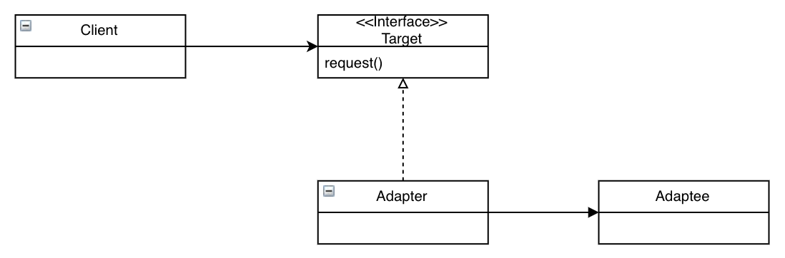

# 어댑터 패턴

## 이해하기

한국에서 쓰던 전자제품을 유럽에 가서 쓰려면 플러그 모양을 바꾸어주는 어댑터를 사용

어댑터의 역할은 국산 플러그와 유럽식 소켓 사이에서 국산 전원 플러그를 유럽식 소켓에 꽂을 수 있게 해 주는 역할

객체지향 어댑터도 똑같은 역할을 수행, 어떤 인터페이스를 클라이언트에서 요구하는 형태의 인터페이스에 적응시켜주는 역할

다음 코드는 Duck 인터페이스와 이를 구현한 MallardDuck 클래스 그리고 새로 등장하는 Turkey 인터페이스와 이를 구현한 WildTurkey 클래스

```java
public interface Duck {
    public void quack();
    public void fly();
}

public class MallardDuck implements Duck {
    public void quack() {
        System.out.println("Quack");
    }

    public void fly() {
        System.out.println("I'm flying");
    }
}

public interface Turkey {
    public void gobble();
    public void fly();
}

public class WildTurkey implements Turkey {
    public void gobble() {
        System.out.println("Gobble gobble");
    }

    public void fly() {
        System.out.println("I'm flying a short distance");
    }
}
```

Duck 객체 대신에 Turkey 객체를 사용해야하는 상황에서 다음과 같은 어탭터 표현

```java
// 적응시킬 형식의 인터페이스를 구현 -> 클라이언트에서 원하는 인터페이스 구현
public class TurkeyAdapter implements Duck {
    Turkey turkey;

    // 원래 형식의 객체에 대한 래퍼런스가 필요
    public TurkeyAdapter(Turkey turkey) {
        this.turkey = turkey;
    }

    public void quack() {
        turkey.gobble()
    }

    public void fly() {
        turkey.fly();
    }
}
```

일반화하면 클라이언트, 어댑터, 어댑티 분류

클라이언트는 타겟 인터페이스에 맞게 구현이 되어있고, 어탭터는 타겟 인터페이스를 구현하며, 어탭티 인스턴스를 소유

어댑터 프로세스는 다음과 같이 동작

1. 클라이언트에서 타겟 인터페이스를 사용하여 메서드를 호출함으로써 어댑터에 요청
2. 어댑터에서는 어댑티 인터페이스를 사용하여 그 요청을 어댑티에 대한 메소드 호출로 변환
3. 클라이언트는 호출결과를 받지만 중간에 어댑터가 있는지 모름

개념: 한 클래스의 인터페이스를 클라이언트에서 사용하고자 하는 다른 인터페이스로 변환, 어댑터를 이용하면 인터페이스 호환성 문제 때문에 같이 쓸 수 없는 클래스들을 연결 사용 가능

이 패턴을 사용하면 호환되지 않는 인터페이스를 사용하는 클라이언트를 그대로 활용, 인터페이스를 변환해주는 어댑터, 이렇게하면 클라이언트와 인터페이스를 분리시킬 수 있고, 나중에 인터페이스가 변경되더라도 어탭터에 캡슐화되기 때문에 클라이언트는 변경할 필요가 없음

다음은 클래스 다이어그램



어댑터 패턴에서는 여러 객체지향 원칙을 찾아볼수가 있음. 어댑티를 새로 바뀐 인터페이스로 감쌀 때는 객체 구성을 사용. 이러면 어댑티의 어떤 서브클래스에 대해서도 어댑터를 쓸 수 있음.

그리고 특정 구현이 아닌 인터페이스에 연결 시키것도 볼수가 있음. 이렇게 하면 나중에 다른 구현을 추가하는것도 쉬움

다음은 실전에서 어댑터를 사용하는 예시

Enumeration을 리턴하는 elements() 메소드가 구현되어 있었던 초기 컬렉션 형식. Enumeration 인터페이스를 이용하면 컬렉션 내에서 각 항목이 관리되는 방식에는 신경 쓸 필요 없이 컬렉션의 모든 항목들에 접근.

이후에 새로운 컬렉션 클래스를 출시하면서 Enumeration과 마찬가지로 일련의 항목들에 접근할수 있게 해주면서 항목을 제거할 수 있는 Iterator 인터페이스를 이용하기 시작.

새로 만든 코드에서는 Iterator 인터페이스만 사용. 그러면 Enumeration을 사용하는 경우에 어댑터 패턴을 적용

여기서 Enumeration 인터페이스의 어댑터가 필요한거니까 Enumeration 인터페이스가 어댑티가 되고 Iterator 인터페이스가 타겟 인터페이스가 되겠지.

```java
public class EnumerationAdapter implements Iterator {
    Enumeration enum;

    public EnumerationAdapter(Enumeration enum) {
        this.enum = enum;
    }

    public boolean hasNext() {
        return enum.hasMoreElements();
    }

    public Object next() {
        return enum.nextElement();
    }

    public void remove() {
        throw new UnsupportedOperationException();
    }
}
```

## 정리

개념: 클래스의 인터페이스를 클라이언트에서 요구하는 다른 인터페이스로 변환. 인터페이스가 호환되지 않아 쓸 수 없었던 클래스들을 같이 사용 가능

* 기존 클래스를 사용하려고 하는데 인터페이스가 맞지 않으면 어댑터 사용
* 어댑터는 인터페이스를 클라이언트에서 원하는 인터페이스로 바꿔주는 역할
* 어댑터를 구현할 때는 타겟 인터페이스의 크기와 구조에 따라 코딩해야 할 분량이 결정
* 어댑터 패턴에는 객체 어댑터 패턴과 클래스 어댑터 패틴이 있습니다. 클래스 어댑터를 쓰려면 다중 상속 기능이 필요
