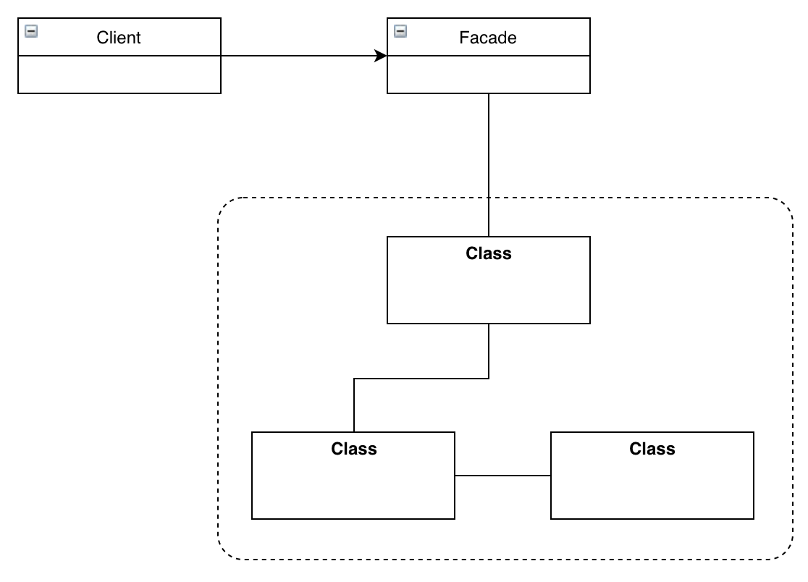

# 퍼사드 패턴

## 미리보기

개념: 서브시스템에 있는 일련의 인터페이스에 대한 통합 인터페이스를 제공. 퍼사드 패턴에서는 서브시스템을 더 쉽게 사용할 수 있게 해 주는 고수준 인터페이스를 정의.

* 큰 인터페이스, 또는 여러 인터페이스를 단순화시키거나 통합시켜야 되는 경우에는 퍼사드를 사용
* 퍼사드는 클라이언트를 복잡한 서브시스템과 분리시켜주는 역할
* 퍼사드 패턴에서는 서브시스템을 가지고 퍼사드를 만들고, 실제 작업은 서브클래스가 수행
* 한 서브시스템에 여러개의 퍼사드도 가능

> 객체지향 원칙 - 친한 친구들하고만 이야기한다.

## 이해하기

퍼사드 패턴의 예시로 홈 씨어터 구축, 홈 씨어터는 DVD 플레이어, 프로젝터, 자동 스크린, 서라운드 음향 및 팝콘 기계까지 갖춘 시스템을 구성

만일 영화를 보려면 다음과 같은 프로세스를 가진다고 생각해보면

1. 팝콘 기계를 켠다
2. 팝콘 튀기기 시작
3. 전등을 어둡게 조절
4. 스크린을 내린다
5. 프로젝터를 켠다
6. 프로젝터로 DVD 신호가 입력되도록 한다
7. 프로젝터를 와이드 스크린 모드로 전환한다
8. 앰프를 켠다
9. 앰프 입력을 DVD로 전환한다
10. 앰프를 서라운드 음량 모드로 전환한다
11. 앰프 볼륨으 중간으로 설정한다
12. DVD 플레이어를 켠다
13. DVD 를 재생한다

코드는 다음과 같음

```java
public class Main {
    public static void main() {
        popper.on();
        popper.pop();

        lights.dim(10);

        screen.down();

        projector.on();
        projector.setInput(dvd);
        projector.wideScreenMode();

        amp.on();
        amp.setDvd(dvd);
        amp.setSurroundSound();
        amp.setVolume(5);

        dvd.on();
        dvd.play(movie);
    }
}
```

만일 영화를 끄려면 어떻게 해야할까?

이러한 여러 복잡한 일을 간단하게 처리하게 해주는게 바로 퍼사드 패턴.

홈 씨어터를 퍼사드 패턴으로 구현하면 다음과 같음

```java
public class HomeTheaterFacade {
    Amplifier amp;
    Tuner tuner;
    DvdPlayer dvd;
    CdPlayer cd;
    Projector projector;
    TheaterLights lights;
    Screen screen;
    PopcornPopper popper;

    public HomeTheaterFacade(Amplifier amp, Tuner tuner, DvdPlayer dvd, CdPlayer cd, Projector projector, TheaterLights lights, Screen screen, PopcornPopper popper) {
        this.amp = amp;
        this.tuner = tuner;
        this.dvd = dvd;
        this.cd = cd;
        this.projector = projector;
        this.lights = lights;
        this.screen = screen;
        this.popper = popper;
    }

    public void watchMovie(String movie) {
        popper.on();
        popper.pop();

        lights.dim(10);

        screen.down();

        projector.on();
        projector.setInput(dvd);
        projector.wideScreenMode();

        amp.on();
        amp.setDvd(dvd);
        amp.setSurroundSound();
        amp.setVolume(5);

        dvd.on();
        dvd.play(movie);
    }

    public void endMovie() {
        popper.off();
        lights.on();
        screen.up();
        projector.off();
        amp.off();
        dvd.stop();
        dvd.eject();
        dvd.off();
    }
}
```

개념: 어떤 서브시스템의 일련의 인터페이스에 대한 통합된 인터페이스를 제공. 퍼사드에서 고수준 인터페이스를 정의하기 때문에 서브시스템을 더 쉽게 사용 가능.

핵심은 퍼사드 패턴은 단순한된 인터페이스를 통해서 서브시스템을 더 쉽게 사용하는 용도. 아래는 퍼사드 패턴의 클래스 다이어그램.



객체지향 원칙에 해당되는 내용으로, 최소 지식 원칙이라고 함

> 최소 지식 원칙(데메테르의 법칙) - 정말 친한 친구하고만 얘기하라

시스템을 디자인할 때, 어떤 객체는 그 객체와 상호작용하는 클래스의 갯수에 주의가 필요. 그런 객체들과 어떤 식으로 상호작용하는지도 중요.

이 원칙을 잘 따르면 복잡하게 얽혀서 시스템의 한 부분을 변경했을 때 다른 부분까지 줄줄이 고쳐야 되는 상황을 미리 방지 가능.

그러면 어떻게 객체하고 인연을 맺는 것을 피할수 있을까? 이 원칙은 몇 가지 가이드라인을 제시하는데 어떤 메소드에서든 다음 네 종류의 객체의 메소드만 호출하면 됨.

1. 객체 자체
2. 메소드에 매개변수로 전달된 객체
3. 그 메소드에서 생성하거나 인스턴스를 만든 객체
4. 그 객체에 속하는 구성요소

다음은 원칙을 안따르는 경우와 따르는 경우에 대한 예시

```java
// 메소드를 호출한 결과로 리턴 받는 객체에 있는 메소드를 호출
// 다른 객체의 일부분에 대해 직접적으로 연관이 됨
public float getTemp() {
    Thermometer thermometer = station.getThermometer();
    return thermometer.getTemperature();
}

public float getTemp() {
    return station.getTemperature();
}
```

퍼사드 패턴도 최소 지식 원칙을 준수한 패턴으로, 클라이언트는 퍼사드 친구가 한명뿐
